#### 有限状态机 ####

表示有限个状态以及在这些状态之间的转移和动作等行为的**数学统计模型**。

#### 有限状态机（FSM）组成部分

- **State** : 系统可能处于的状态。每个状态反映的是系统的某个模式或环节。有限状态机的状态是有限的。

- **Input** : 外部输入的信号，会影响状态的转换。

- **Output** : 状态机在特定条件下输出的信号。

- **Transitions** : 系统根据状态转移函数从一个状态转移到另一个状态。

- **Initial State** : 系统的初始状态。 

  

#### 例题（字符串匹配） ####

在了解有限状态机的两种类型前，我们先来看一道例题（选自BUAA_CO_P0）

> 使用Logisim搭建一个有限状态机检测串行输入字符串中的能匹配正则表达式b{1,2}[ac]{2}的子串并输出。即我们要得到这样一个字符串：开头有一个或两个b，接着要出现两次a/c。
>
> **注意：**每当匹配到一个子串时，需要输出一次1。例如对字符串bacbacac,模块应当在第1个c输入和第2个c输入时输出1,而在其他时刻保持输出为0。

#### Moore Machine ####

我们先通过Moore状态机来实现题目要求。Moore状态机是有限状态机的一种，其输出仅依赖于当前状态。即只要系统处于某个特定状态，无论当前输入是什么，都会有对应的输出。

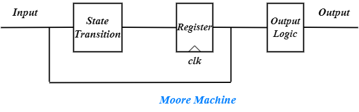

首先我们先画出**状态转移图**

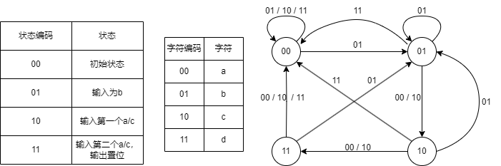

根据上图我们可以轻松地在**logisim**中搭出相应的电路

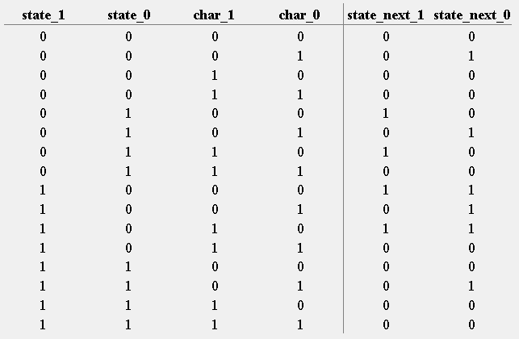

<i>利用真值表构建状态转移模块</i>

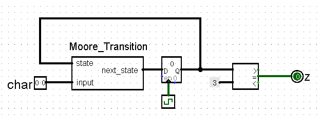

#### Mealy Machine ####

再利用Mealy状态机实现题目要求。Mealy状态机是有限状态机的另外一种，其输出结果不仅和当前状态有关，还和当前输出有关。

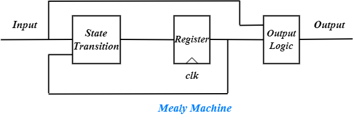

我们仍然是先画出**状态转移图**

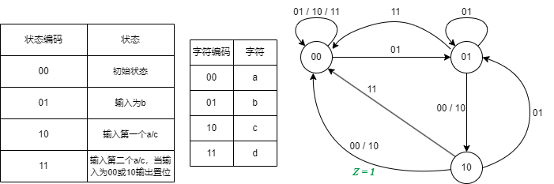

在**logisim**中搭建相应电路

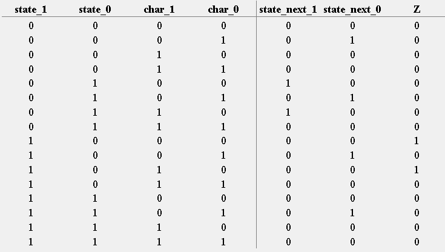

<i>利用真值表构建状态转移模块</i>

由于Mealy状态机的输出Z由状态和输出共同决定，所以可以在构建真值表时直接根据状态和输入给出Z的值。

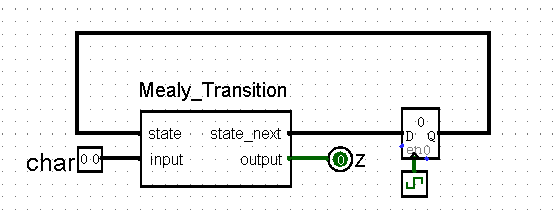

#### Moore & Mealy ####

下面我们通过波形图的方式分析两种有限状态机的差别。

* 上升沿输入一个字符，且输入在一个周期内保持不变

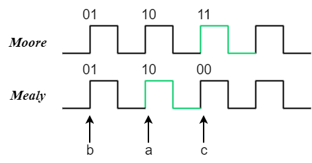

Moore状态机在读入字符c后状态变为11，经过判断符合置位条件，输入变为1，非常符合我们的直觉。

Mealy状态机则在读入字符a后输入就变为1，因为读入a之后状态变为10，此时输入仍为a，状态机识别到字符序列baa，符合置位条件，输入变为1，而在读入c之后状态变为00，不再符合置位条件。

* 下降沿输入一个字符，且输入在一个周期内保持不变

  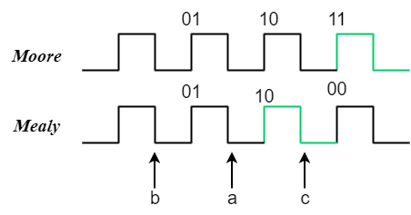

  虽然是下降沿读入一个字符，但是状态机的状态在上升沿时才会更新，所以对于Moore状态机，其实就等于上一种情况滞后一个周期。

  对于Mealy状态机，在状态更新为10后，输入仍为a，检测序列为baa，符合置位条件，在之后的下降沿输入变为c，此时检测序列为bac，仍符合置位条件。

  

* 异步输入

  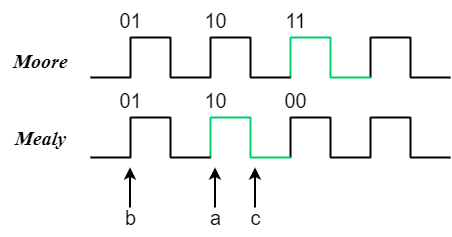

  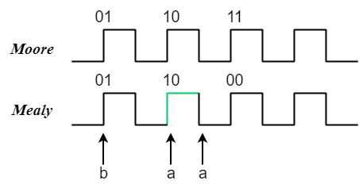

  在接收到字符a后的一个周期内任意时刻输入c，Mealy状态机的输出都会立刻发生变化，而Moore状态机则需要等到下一个时钟上沿到来输出才会变化。

  

#### 总结 ####

* 对于本题来说，Moore状态机和Mealy状态机实现的功能有所差异。

* **Moore状态机同步输出，Mealy状态机异步输出。**Mealy对输入的反应更快。
* 实现相同功能，Mealy所需要的状态数比Moore型少，Moore需要状态稳定才能输出。（对于异步输入来说，因为同步输入时结果并不相同）
* 并非所有时许电路都可以用Mealy状态机实现，一些时序逻辑电路只能通过Moore状态机实现。