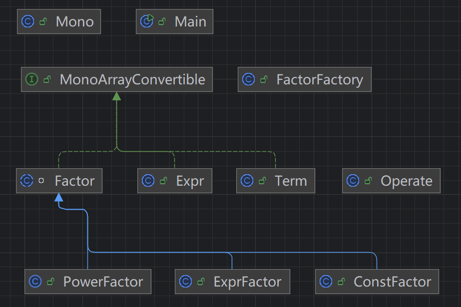

# BUAA-OO-HW1

## 题目理解

>本次作业需要完成的任务为：读入一个包含加、减、乘、乘方以及括号（其中括号的深度**至多为 1 层**）的**单变量**表达式，输出**恒等变形展开所有括号后**的表达式。
>
>在本次作业中，**展开所有括号**的定义是：对原输入表达式 *E* 做**恒等变形**，得到新表达式 *E*，且 *E* 中不含有字符 `(` 和 `)` 。

简单来说就是表达式的等价变形，并且尽可能地化简。表达式化简到最简形式即为多项式（单项式的和）。
$$
\sum ax^{b}
$$
所以我们可以创建一个类，把表达式分解成一个个单项式，最后合并同类项即可。

```java
public class Mono {
    int coe; //系数
    int varsPow; //变量x的指数
}
```

接着我们试着分析表达式的构成。

- Expr：表达式，即我们要化简的表达式
- Term：项，Term由'+'（不被括号包裹的加号）连接即构成了Expr，对于'-'我们可以将其替换为"+-"，认为后一个元素的系数为负数。
- Factor：因子，Factor由'*'（不被括号包裹的乘号）连接即构成了Term
  - ConstFactor：常数因子 (example：-125, -007, 25)
  - PowerFactor：幂函数因子 (example：x^2, x)
  - ExprFactor：表达式因子，带括号的均为表达式因子，括号内是一个Expr (example：（x+1)^2, (x-1)^0, (2*x+3))

## 设计思路



### 抽象类 Factor

Factor由ConstFactor, PowerFactor, ExprFactor构成，让三类因子继承抽象父类Factor可以减少重复代码，统一行为。

```java
abstract class Factor implements MonoArrayConvertible {
    private final String factor;

    public Factor(String factor) {
        this.factor = factor;
    }

    public String getFactor() {
        return factor;
    }
}
```

### 工厂模式 FactorFactory

因为我们在new一个Factor的时候是不知道这个Factor的类型的，所以我们需要一个工厂，为我们提供对应的class。

工厂的作用就是传入一个字符串，判断其是哪一种Factor，返回相应的class。

> *这里用到了多态的思想：即同类型（Factor）的对象表现出不同的特征（不同Factor的方法不一样）。*

### 接口 MonoArrayConvertible

对于Expr, Term, Factor都是可以对转化为单项式的，所以定义一个接口，统一方法。

ConstFactor, PowerFactor本身就是一个单项式，Expr, Term, ExprFactor可以分解为多个单项式。为了统一，我们规定getMono返回的是一个ArrayList。

```java
public interface MonoArrayConvertible {
    ArrayList<Mono> getMonos();
}
```

### 方法类 Operate

提供多种static方法，用于对ArrayList\<Mono\>进行处理。

- 两个ArrayList\<Mono\>相乘
- 两个ArrayList\<Mono\>相加
- 合并ArrayList\<Mono\>中的同类项

## 程序运行逻辑

### 提取子元素

即Expr类中用一个ArrayList存储Term，Term类中用一个ArrayList存储Factor

可以实现一个private方法用来提取，每次new的时候在构造函数中调用提取函数。

### 获取多项式

遍历获取所有单项式

- Expr.getMono() -> 遍历Term.getMono() -> 遍历Factor.getMono() 
  - 对于ExprFactor，提取subExpr，重复上述过程获得subExpr的ArrayList\<Mono\>，然后根据指数不断与自己相乘(Operate.mul)

### 拼接单项式

用加号拼接即可，然后化简、合并同类相。


## Tips

- 可根据指导书中的形式化表述构造正则表达式进行解析
- Integer.parserInt无法解析+-, 可以处理前导零
- 如果一个类覆写了toString这个方法，那么其可以被看作一个String类，单招腹泻的toString逻辑生成字符串。覆写Mono的toString，可以起到化简单项式的作用，如$2x^0$可化简为2
- 可使用System.err.println()帮助调试