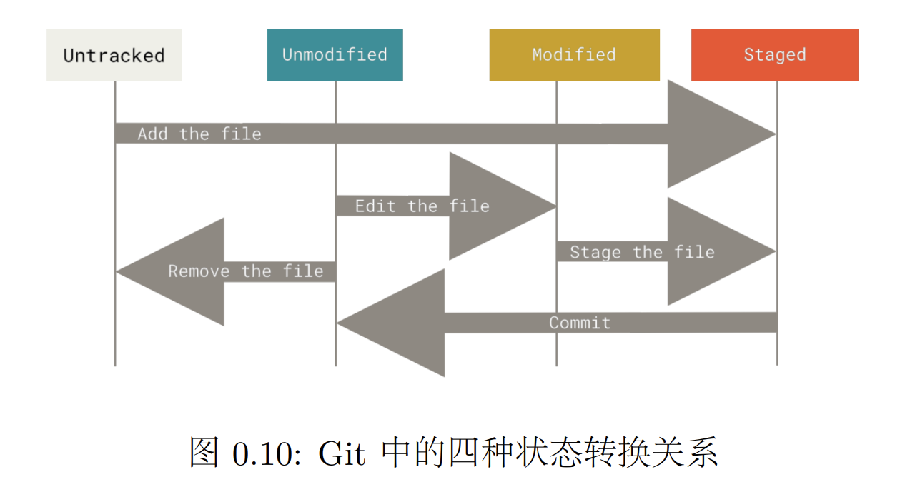

# OS-lab0 实验报告

## 思考题

### Thinking 0.1

> - 在前述已初始化的 ~/learnGit 目录下，创建一个名为 README.txt 的文件。执 行命令 git status > Untracked.txt（其中的 > 为输出重定向，我们将在 0.6.3 中 详细介绍）。 
>- 在 README.txt 文件中添加任意文件内容，然后使用 add 命令，再执行命令 git status > Stage.txt。 
> - 提交 README.txt，并在提交说明里写入自己的学号。
> - 执行命令 cat Untracked.txt 和 cat Stage.txt，对比两次运行的结果，体会 README.txt 两次所处位置的不同。
> - 修改 README.txt 文件，再执行命令 git status > Modified.txt。
> - 执行命令 cat Modified.txt，观察其结果和第一次执行 add 命令之前的 status 是 否一样，并思考原因。

不一样，新建一个文件但不git add，README.txt处于未跟踪状态；git add之后会跟踪README.txt文件，此时文件处于已暂存状态；提交后修改README.txt文件，此时文件处于已修改状态，但是还未添加到暂存区。


### Thinking 0.2

> 仔细看看0.10，思考一下箭头中的 add the file 、stage the file 和 commit 分别对应的是 Git 里的哪些命令呢？
>
> 

add the file对应git add，stage the file对应git add，commit对应git commit


### Thinking 0.3

> 思考下列问题： 
>
> 1. 代码文件 print.c 被错误删除时，应当使用什么命令将其恢复？ 
>2. 代码文件 print.c 被错误删除后，执行了 git rm print.c 命令，此时应当 使用什么命令将其恢复？ 
> 3. 无关文件 hello.txt 已经被添加到暂存区时，如何在不删除此文件的前提下 将其移出暂存区？

1. 如果文件在暂存后被删除，可以使用git checkout -- print.c恢复。如果文件在删除前执行了git commit，在删除后执行了git add指令，可以使用git reset HEAD恢复到上一次commit时的状态，之后再使用git checkout -- print.c恢复文件。
2. 先使用git restore --staged print.c取消暂存，再使用git restore print.c放弃工作区的修改。
3. git rm --cached hello.txt


### Thinking 0.4

> 思考下列有关 Git 的问题：
>
> - 找到在 /home/22xxxxxx/learnGit 下刚刚创建的 README.txt 文件，若不存 在则新建该文件。
>- 在文件里加入 Testing 1，git add，git commit，提交说明记为 1。
> - 模仿上述做法，把 1 分别改为 2 和 3，再提交两次。
> - 使用 git log 命令查看提交日志，看是否已经有三次提交，记下提交说明为 3 的哈希值a。
> - 进行版本回退。执行命令 git reset --hard HEAD^ 后，再执行 git log，观察其变化。
> - 找到提交说明为 1 的哈希值，执行命令 git reset --hard  \<hash\>后，再执 行 git log，观察其变化。
> - 现在已经回到了旧版本，为了再次回到新版本，执行 git reset --hard  \<hash\>，再执行 git log，观察其变化。

- 有三次提交
- HEAD指向说明为2的提交，并且不显示说明为3的提交
- HEAD指向说明为1的提交，并且不显示说明为2, 3的提交
- HEAD指向说明为3的提交


### Thinking 0.5

> 执行如下命令, 并查看结果
>
> - echo first
>- echo second > output.txt
> - echo third > output.txt
> - echo forth >> output.txt

- 在终端显示"first"
- 创建了一个output.txt文件，内容为"second"
- output.txt内容变为"third"
- output.txt追加内容"forth"


### Thinking 0.6

> 使用你知道的方法（包括重定向）创建下图内容的文件（文件命名为 test）， 将创建该文件的命令序列保存在 command 文件中，并将 test 文件作为批处理文件运行，将 运行结果输出至 result 文件中。给出 command 文件和 result 文件的内容，并对最后的结果进行解释说明（可以从 test 文件的内容入手）. 具体实现的过程中思考下列问题: echo echo Shell Start 与 echo \`echo Shell Start\` 效果是否有区别; echo echo \$c>file1 与 echo \`echo \$c>file1\` '效果是否有区别.

```bash
#!/bin/bash

echo 'echo Shell Start...' > test
echo 'echo set a = 1' >> test
echo 'a=1' >> test
echo 'echo set b = 2' >> test
echo 'b=2' >> test
echo 'echo set c = a+b' >> test
echo 'c=$[$a+$b]' >> test
echo 'echo c = $c' >> test
echo 'echo save c to ./file1' >> test
echo 'echo $c>file1' >> test
echo 'echo save b to ./file2' >> test
echo 'echo $b>file2' >> test
echo 'echo save a to ./file3' >> test
echo 'echo $a>file3' >> test
echo 'echo save file file2 file3 to file4' >> test
echo 'cat file1>file4' >> test
echo 'cat file2>>file4' >> test
echo 'cat file3>>file4' >> test
echo 'echo save file4 to ./result' >> test
echo 'cat file4>>result' >> test
```

```bash
3
2
1
```

**结果分析**：

- test先将a和b分别赋值为1和2
- 令c等于a+b
- 将c，b，a的值分别写入file1、file2、file3，三个文件中的值分别为3, 2, 1
- cat将这三个文件的值**追加**到file4，再把file4中的内容写入result。
- result中的值为3, 2, 1。

`echo echo Shell Start` 与 `echo ‘echo Shell Start’` 效果没有区别； `echo echo $c>file1` 与 `echo ‘echo $c>file1’` 效果有区别，前者会将"echo \$c"重定向到file1，而后者则会在终端显示"echo $c>file"。


## 实验难点

### Git的使用

#### 工作区、暂存区、版本库、HEAD的理解

- 工作区（Working Directory），电脑上的一个目录即为工作区。

- 版本库（Repository），使用`git init`指令，目录下会生成一个.git目录，这个.git目录就是git的版本库（.git不属于工作区），git版本库里有暂存区和一个指向当前分支的HEAD指针。

- 暂存区（stage/index），使用`git add`可以把修改后的文件添加到暂存区，以便于一次性提交多个修改。

- HEAD，HEAD指向的是当前分支（master/main...），也可以指向某一个commit（分离状态）。

  - 分离状态，有时候我们只是想在之前的某一次commit上做一些调试而不想提交到版本库，我们就可以`git checkout <hash>`切换到某一个commit进入HEAD分离状态，在进行一些修改并提交后，如果此时再切换到原有分支则会丢弃之前做的所有实验性修改，如果想保留修改，则可使用`git checkout -b <new branch name>`新建一个分支保存修改。

  > You are in 'detached HEAD' state. You can look around, make experimental
  >
  > changes and commit them, and you can discard any commits you make in this
  >
  > state without impacting any branches by switching back to a branch.
  >
  > 
  >
  > If you want to create a new branch to retain commits you create, you may
  >
  > do so (now or later) by using -c with the switch command. Example:
  >
  > 
  >
  >  git switch -c <new-branch-name>
  >
  > 
  >
  > Or undo this operation with:
  >
  > 
  >
  >  git switch -
  >
  > 
  >
  > Turn off this advice by setting config variable advice.detachedHead to false

#### 版本回退

- git reset [--hard] [--soft] [--mixed]，同时移动当前分支指针和HEAD指针，`--hard`会回退到上个版本的已提交状态，而`--soft`会回退到上个版本的未提交状态，`--mixed`会回退到上个版本已添加但未提交的状态。
- git checkout \<hash\>，仅移动HEAD指针，不一定分支指针（HEAD分离状态）。
- git checkout -- \<file\>，将暂存区的指定文件取出，强制替换工作区的文件。
- git restore \<file\>，功能和git checkout相同。
- git rm --cached \<file\>，从暂存区中删去不想跟踪的文件。

#### 冲突解决

当两个分支对同一行进行了修改，在合并时会出现冲突，git无法帮我们完成合并，需要手动解决冲突。


- git merge，无破坏性，两个分支的提交均会被保存，但时间线会变复杂。


- git rebase，重写原始分支的提交历史，将当前修改融合到原始分支中，原始分支的hash会变，时间线更干净但是损失了很多信息，可回溯性差。


### Makefile

- 本质上target和dependencies都是文件，如果target已经存在，且创建时间晚于所有dependencies，则make不会执行命令。
- 如果一个规则的命令没有创建target文件，我们希望每次执行`make <target>`都会执行这个规则的命令，但是如果我们手动创建了一个target文件，则命令不会被执行，这是我们可以把这个target声明为伪目标，例如`.PHONY: clean`


### Shell脚本

#### 转义

- 单引号保留字符的字面含义，单引号内不能再使用单引号，即使使用了反斜线转义也不允许。
- 双引号内美元符号`$` ，反引号`` `，反斜杠`\`仍然有特殊含义

#### 括号

- [] 逻辑运算
- (()) 用于算术表达式，也可在其中进行变量赋值
- ${} 取变量的值
- $[] 和 \$(()) 数值计算并返回值
- $() 运行括号中的命令并将输出替换到原处


### Sed (Stream editor)

```bash
sed [选项] '命令' 输入文本
```

sed命令本身是可以解释语法的，即传入一个字符串作为命令，sed可以解析这个字符串，而我们如果要在命令中使用变量直接输入‘\$1,\$p’是无法被正确解析的，因为在sed命令看来$1就是一个普通字符串，我们应该把\$1交给shell去解析。很简单，只需要\$1放在单引号外面即可。

于是，关于sed如何和shell交互的问题可以得出一套结论：

1. 遇到需要被shell解析的都不加引号，或者加双引号；
2. 遇到shell和所执行命令共有的特殊字符时，要想被sed解析，必须加单引号，或者在双引号在加反斜线转义；

```bash
➜  learnSed cat tail.sh 
#!/bin/bash
sed -n $1',$p' $2
➜  learnSed bash tail.sh 4 test
line4
line5
line6
```


## 实验体会

- git的基本操作很简单，但是在实际多人合作中，版本回退、冲突处理等问题层出不穷，没有深入的理解很难提高效率。
- 刚开始接触linux和CLI，只会一些基础命令，对shell脚本的理解不深，导致上机测试手忙脚乱，不能很快定位错误。
- 指导书中的命令只是冰山一角，要熟练使用shell仍需要花大量的时间去自学。


## 参考资料

- 在开发过程中使用 git rebase 还是 git merge，优缺点分别是什么？https://www.zhihu.com/question/36509119/answer/2423381574

- 廖雪峰的Makefile教程 https://liaoxuefeng.com/books/makefile/introduction/index.html

- sed中的疑难杂症 https://zhuanlan.zhihu.com/p/691207825

  