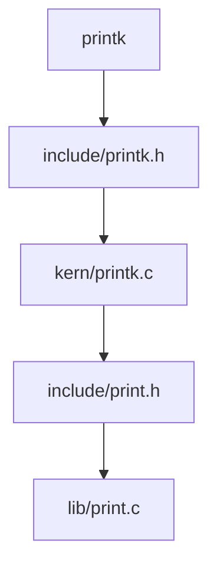

# BUAA-OS-lab1杂记

## 字节序（byte order）

Little endian(小端)与Big endian(大端)

> “endian”这个词出自 Jonathan Swin 在 1726 年写的讽刺小说《格列佛游记》( Guliver's Travels )，小人国的内战就源于吃水煮鸡蛋时究竟是从大头(Big-Endian)敲开还是从小头(Little-Endian)敲开，由此曾发生过 6 次叛乱，其中一个皇帝送了命，另一个丢了王位。

MSB（most significant bit/byte）LSB（least significant bit/byte）

Little-endian 把MSB存放在高地址，Big-endian把MSB存放在低地址

例如0x12345678

|      | 0字节 | 1字节 | 2字节 | 3字节 |
| ---- | ----- | ----- | ----- | ----- |
| EL   | 0x78  | 0x56  | 0x34  | 0x12  |
| EB   | 0x12  | 0x34  | 0x56  | 0x78  |

Big-endian在内存中的顺序比较符合数字的书写习惯，而Little-endian可以确保在变量指针转换的时候地址保持不变。比如`uint32*`转换为`char*`，只需要取0字节即可。

使用readelf -h可以查看elf header信息，可以看到mos操作系统是Little-endian的。


## ELF

程序代码被编译和链接成包含二进制计算机指令的可执行文件。而可执行文件是有格式规范的，在 Linux 中，这个规范叫 Executable and Linkable format (ELF)。ELF 中包含二进制计算机指令、静态数据、元信息。

从ELF的全称可以看出，ELF文件有两个特性Executable可执行的和Linkable可链接的，对应的ELF文件有两种视角。

- Linking view链接视角，节头表（section header table）包含了链接时所需的信息，告诉操作系统如何链接可执行文件，完成进程内存的初始化。
- Execution view执行视角，段头表（program header table）包含了运行时加载程序所需的信息，告诉操作系统如何加载可执行文件，完成进程内存的初始化。一个可执行的ELF一定有program header table。


ELF有三种类型

- relocatable 可重定位文件
- executable 可执行文件
- shared object 共享对象文件

## readelf

c语言中结构体就是一片连续的内存，elf.h文件里的结构体实际上是对内存的一种映射。

我们在main.c中获得了一个指向ELF文件二进制数据的指针p，接着我们要实现的就是根据ELF文件的结构去解析这些二进制数据。

解析之前我们需要先判断这些二进制数据是不是ELF文件。

先假设这些数据是ELF格式的（将指针转换为我们定义的Elf32_Ehdr去读取ELF的文件头），ELF文件头里的e_ident就是用于告诉外界这是一个ELF文件的，我们只需要判断e_ident里是不是特定内容即可。

```c
int is_elf_format(const void *binary, size_t size) {
	Elf32_Ehdr *ehdr = (Elf32_Ehdr *)binary;
	return size >= sizeof(Elf32_Ehdr) && ehdr->e_ident[EI_MAG0] == ELFMAG0 &&
	       ehdr->e_ident[EI_MAG1] == ELFMAG1 && ehdr->e_ident[EI_MAG2] == ELFMAG2 &&
	       ehdr->e_ident[EI_MAG3] == ELFMAG3;
}
```

```c
typedef struct {
	unsigned char e_ident[EI_NIDENT]; /* Magic number and other info */
	Elf32_Half e_type;		  /* Object file type */
	Elf32_Half e_machine;		  /* Architecture */
	Elf32_Word e_version;		  /* Object file version */
	Elf32_Addr e_entry;		  /* Entry point virtual address */
	Elf32_Off e_phoff;		  /* Program header table file offset */
	Elf32_Off e_shoff;		  /* Section header table file offset */
	Elf32_Word e_flags;		  /* Processor-specific flags */
	Elf32_Half e_ehsize;		  /* ELF header size in bytes */
	Elf32_Half e_phentsize;		  /* Program header table entry size */
	Elf32_Half e_phnum;		  /* Program header table entry count */
	Elf32_Half e_shentsize;		  /* Section header table entry size */
	Elf32_Half e_shnum;		  /* Section header table entry count */
	Elf32_Half e_shstrndx;		  /* Section header string table index */
} Elf32_Ehdr;

/* Fields in the e_ident array.  The EI_* macros are indices into the
   array.  The macros under each EI_* macro are the values the byte
   may have.  */

#define EI_MAG0 0    /* File identification byte 0 index */
#define ELFMAG0 0x7f /* Magic number byte 0 */

#define EI_MAG1 1   /* File identification byte 1 index */
#define ELFMAG1 'E' /* Magic number byte 1 */

#define EI_MAG2 2   /* File identification byte 2 index */
#define ELFMAG2 'L' /* Magic number byte 2 */

#define EI_MAG3 3   /* File identification byte 3 index */
#define ELFMAG3 'F' /* Magic number byte 3 */
```

知道了这些二进制数据是一个ELF格式的文件之后我们就可以解析了。课程组需要我们实现的是解析section header table，我们该如何找到section header table呢？显然ELF文件头里已经告诉我们了，且还告诉了我们tabel里有几个header，每个header有多大，我们只需要在当前指针加上一个偏移量即可找到section header table。

> 为什么要把binary转换为char类型的指针？
>
> 假设偏移量为1，const void类型的指针不知道1指的是1字节还是1比特，而转换为char类型的指针指示就明确了偏移量的单位是一个char，即一字节。

```c
	// Get the address of the section table, the number of section headers and the size of a
	// section header.
	const void *sh_table;
	Elf32_Half sh_entry_count;
	Elf32_Half sh_entry_size;
	/* Exercise 1.1: Your code here. (1/2) */
	Elf32_Off sh_off = ehdr->e_shoff; // section header table file offset
	sh_entry_count = ehdr->e_shnum; // table entry num
	sh_entry_size = ehdr->e_shentsize; // size of each table entry 
	sh_table = (const void *)((char *)binary + sh_off); // move to section header
```

找到section header table之后输出每个header的地址即可。需要注意的是结构体Elf32_Shdr映射的是一个section header，移动指针的时候需要转换指针类型确保每次移动一个header的长度。

```c
	// For each section header, output its index and the section address.
	// The index should start from 0.
	for (int i = 0; i < sh_entry_count; i++) {
		const Elf32_Shdr *shdr;
		unsigned int addr;
		/* Exercise 1.1: Your code here. (2/2) */
		shdr = (const Elf32_Shdr *)sh_table + i;
		addr = shdr->sh_addr;
		printf("%d:0x%x\n", i, addr);
	}
```

```c
/* Section segment header.  */
typedef struct {
	Elf32_Word sh_name;	 /* Section name */
	Elf32_Word sh_type;	 /* Section type */
	Elf32_Word sh_flags;	 /* Section flags */
	Elf32_Addr sh_addr;	 /* Section addr */
	Elf32_Off sh_offset;	 /* Section offset */
	Elf32_Word sh_size;	 /* Section size */
	Elf32_Word sh_link;	 /* Section link */
	Elf32_Word sh_info;	 /* Section extra info */
	Elf32_Word sh_addralign; /* Section alignment */
	Elf32_Word sh_entsize;	 /* Section entry size */
} Elf32_Shdr;
```


## 加载内核文件

了解了ELF格式之后，我们就要开始学习如何我们的mos操作系统内核了。

对于32位处理器，MIPS体系结构中的虚拟内存为4GB。

课程组已经贴心地给出了内存图，我们只需要把各部分放到正确的地址即可。

根据内存图，我们把.text放到kernel text处（0x80020000），.data和.bss依次放置即可。

- .text 保存可执行文件的操作指令。

- .data 保存已初始化的全局变量和静态变量。
-  .bss 保存未初始化的全局变量和静态变量。

.text .data .bss是ELF中比较重要的三个section。

```c
/*
 o     4G ----------->  +----------------------------+------------0x100000000
 o                      |       ...                  |  kseg2
 o      KSEG2    -----> +----------------------------+------------0xc000 0000
 o                      |          Devices           |  kseg1
 o      KSEG1    -----> +----------------------------+------------0xa000 0000
 o                      |      Invalid Memory        |   /|\
 o                      +----------------------------+----|-------Physical Memory Max
 o                      |       ...                  |  kseg0
 o      KSTACKTOP-----> +----------------------------+----|-------0x8040 0000-------end
 o                      |       Kernel Stack         |    | KSTKSIZE            /|\
 o                      +----------------------------+----|------                |
 o                      |       Kernel Text          |    |                    PDMAP
 o      KERNBASE -----> +----------------------------+----|-------0x8002 0000    |
 o                      |      Exception Entry       |   \|/                    \|/
 o      ULIM     -----> +----------------------------+------------0x8000 0000-------
 o                      |         User VPT           |     PDMAP                /|\
 o      UVPT     -----> +----------------------------+------------0x7fc0 0000    |
 o                      |           pages            |     PDMAP                 |
 o      UPAGES   -----> +----------------------------+------------0x7f80 0000    |
 o                      |           envs             |     PDMAP                 |
 o  UTOP,UENVS   -----> +----------------------------+------------0x7f40 0000    |
 o  UXSTACKTOP -/       |     user exception stack   |     PTMAP                 |
 o                      +----------------------------+------------0x7f3f f000    |
 o                      |                            |     PTMAP                 |
 o      USTACKTOP ----> +----------------------------+------------0x7f3f e000    |
 o                      |     normal user stack      |     PTMAP                 |
 o                      +----------------------------+------------0x7f3f d000    |
 a                      |                            |                           |
 a                      ~~~~~~~~~~~~~~~~~~~~~~~~~~~~~~                           |
 a                      .                            .                           |
 a                      .                            .                         kuseg
 a                      .                            .                           |
 a                      |~~~~~~~~~~~~~~~~~~~~~~~~~~~~|                           |
 a                      |                            |                           |
 o       UTEXT   -----> +----------------------------+------------0x0040 0000    |
 o                      |      reserved for COW      |     PTMAP                 |
 o       UCOW    -----> +----------------------------+------------0x003f f000    |
 o                      |   reversed for temporary   |     PTMAP                 |
 o       UTEMP   -----> +----------------------------+------------0x003f e000    |
 o                      |       invalid memory       |                          \|/
 a     0 ------------>  +----------------------------+ ----------------------------
 o
*/
```


	SECTIONS {
		/* Exercise 3.10: Your code here. */
	
		/* fill in the correct address of the key sections: text, data, bss. */
		/* Hint: The loading address can be found in the memory layout. And the data section
		 *       and bss section are right after the text section, so you can just define
		 *       them after the text section.
		 */
		/* Step 1: Set the loading address of the text section to the location counter ".". */
		/* Exercise 1.2: Your code here. (1/4) */
		. = 0x80020000;
		/* Step 2: Define the text section. */
		/* Exercise 1.2: Your code here. (2/4) */
		.text : { *(.text) }
		/* Step 3: Define the data section. */
		/* Exercise 1.2: Your code here. (3/4) */
		.data : { *(.data) }
		bss_start = .;
		/* Step 4: Define the bss section. */
		/* Exercise 1.2: Your code here. (4/4) */
		.bss : { *(.bss) }
		bss_end = .;
		. = 0x80400000;
		end = . ;
	}
其实内存布局并不像内存图画的那样界限分明，.text放到其他地方也是可以正常运行的，比如把.text放到0x80010000也是可以正常运行的，不过最好遵循课程组的要求。


## 内核入口

在把对应的section加载到正确的位置后，我们需要考虑如何启动内核。第一步当然是找到内核的入口了。

打开init目录下的start.S，补全我们的代码，将 sp 寄存器设置到内核栈空间的位置上，随后跳转到 mips_init 函数。

在kernel.lds文件中我们看到这样一行，其作用是告诉链接器程序的入口地址，即程序执行的第一条指令的地址。

```
ENTRY(_start)
```

那么这个_start在哪呢？在start.S文件中我们看到这样一行，其作用是声明一个全局符号\_start，使链接器能找到\_start。

```assembly
EXPORT(_start)
```

在include/asm/asm.h文件下我们可以看到EXPORT宏的展开形式。

```c
#define EXPORT(symbol)                                                                             \
	.globl symbol;                                                                             \
	symbol:
```

继续往下看，我们看到以下两行代码

```assembly
.set at
.set reorder
```

在上学期的co中，我们在mars里一定看到过一个叫$at的寄存器，其全称是**Assembler Temporary**，即临时寄存器。

在mips中有一些指令本身并不是 MIPS 硬件支持的原生指令，而是由汇编器自动翻译成一条或多条真正的 MIPS 指令。比如`li`指令。

```assembly
li $t0, 0x12345678  # 伪指令
```

这条指令会被汇编器翻译为

```assembly
lui $at, 0x1234
ori $t0, $at, 0x5678
```

这里就用到了at寄存器。`.set at`指令就是告诉汇编器允许使用at寄存器进行伪指令展开。如果使用了`.set noat`，那么汇编器再遇到需要使用到at寄存器的伪指令时会报错。

在co中我们对流水线印象深刻。我们知道一些指令会在不影响结果的情况下被放到延迟槽里执行，这项工作也是由汇编器来完成的，`.set reorder`指令就是允许汇编器对指令进行重排的，我们也可以使用`.set noreorder`来禁止汇编器的重排行为。

完成了一些初始化设置之后，start.S文件会先对.bss区域进行清零操作，即未初始化的全局变量和静态变量初始值为0。这里我们回顾一下c语言中的变量类型。

- static类型的int变量存储在.bss（未初始化）和.data（已初始化）生命周期是从主程序的开始到结束，我们每次调用func函数变量c和d都会自增1。需要注意的是，虽然它们的生命周期是整个程序的运行周期，但它们只在其定义的函数内可访问。
- 普通类型的int变量存储在栈上，其生命周期是从函数的开始到结束，每次进入 `func()` 时会重新分配内存，并在函数返回时销毁。
- 普通类型的变量如何没有初始化其数值是不确定的，static类型的变量如果未初始化其数值默认为0。

```c
#include<stdio.h>
int a = 5;	// staged in .data
int b;		// staged in .bss

void func() {
	static int c = 1;	// staged in .data
	c++;
	static int d;		// staged in .bss
	d++;
	int e = 7;		// staged in stack
	e++;
	int f;			// staged in stack
	f++;
	printf("c is %d\n", c);
	printf("d is %d\n", d);
	printf("e is %d\n", e);
	printf("f is %d\n\n", f);

}

int main() {
	func();
	func();
	func();
	return 0;
}
```

```shell
git@23373112:~/learnClang $ gcc main.c -o main && ./main
c is 2
d is 1
e is 8
f is 32677

c is 3
d is 2
e is 8
f is 32678

c is 4
d is 3
e is 8
f is 32679
```

.bss清零结束之后，程序会先把CP0状态置为0禁用中断，确保内核的初始化不会被打断，然后把栈指针放到正确的位置，最后跳转到mips_init（init/init.c文件中），对于lab1，mips_init只有打印的功能。

```c
void mips_init(u_int argc, char **argv, char **penv, u_int ram_low_size) {
	printk("init.c:\tmips_init() is called\n");

	// lab2:
	// mips_detect_memory(ram_low_size);
	// mips_vm_init();
	// page_init();

	// lab3:
	// env_init();

	// lab3:
	// ENV_CREATE_PRIORITY(user_bare_loop, 1);
	// ENV_CREATE_PRIORITY(user_bare_loop, 2);

	// lab4:
	// ENV_CREATE(user_tltest);
	// ENV_CREATE(user_fktest);
	// ENV_CREATE(user_pingpong);

	// lab6:
	// ENV_CREATE(user_icode);  // This must be the first env!

	// lab5:
	// ENV_CREATE(user_fstest);
	// ENV_CREATE(fs_serv);  // This must be the second env!
	// ENV_CREATE(user_devtst);

	// lab3:
	// schedule(0);
	halt();
}
```


> 我们在内存图中可以找到kernel stack的位置，但是为什么栈帧要设置在kernel stack的栈顶（KSTACKTOP = 0x8004000）？
>
> 进程地址的分布取决于操作系统，栈向什么方向增长取决于操作系统与CPU的组合。
>
> 是否还记得上学期计算机组成原理中mips是如何在调用函数前保护和恢复寄存器的，是先\$sp自减再\$sp自增，表明对于mips指令集栈的生长方向是由高地址向低地址生长的。
>
> 至于为什么要这样设定，更多的是历史原因，许多早期处理器在基址寄存器寻址时仅支持无符号偏移，因此如果栈向低地址增长，相对栈指针的地址计算更高效。

```assembly
#include <asm/asm.h>
#include <mmu.h>

.text
EXPORT(_start)
.set at
.set reorder
/* Lab 1 Key Code "enter-kernel" */
	/* clear .bss segment */
	la      v0, bss_start
	la      v1, bss_end
clear_bss_loop:
	beq     v0, v1, clear_bss_done
	sb      zero, 0(v0)
	addiu   v0, v0, 1
	j       clear_bss_loop
/* End of Key Code "enter-kernel" */

clear_bss_done:
	/* disable interrupts */
	mtc0    zero, CP0_STATUS

	/* hint: you can refer to the memory layout in include/mmu.h */
	/* set up the kernel stack */
	/* Exercise 1.3: Your code here. (1/2) */
	la sp, KSTACKTOP
	/* jump to mips_init */
	/* Exercise 1.3: Your code here. (2/2) */
	j mips_init
```


## printk

### 调用链

完成了之前的工作，我们的内核已经能正常启动了，现在要做的是实现打印功能，即完成printk函数，使mips_init中的printk函数能正确被调用。

观察init.c的头文件声明部分。

```c
#include <asm/asm.h>
#include <env.h>
#include <pmap.h>
#include <printk.h>
#include <sched.h>
#include <trap.h>
```

显然printk函数的声明在printk.h文件中，下面我们来分析printk.h代码。

```c
# include/printk.h

#ifndef _printk_h_
#define _printk_h_

#include <machine.h>
#include <stdarg.h>

void printk(const char *fmt, ...);

void _panic(const char *, int, const char *, const char *, ...)
#ifdef MOS_HANG_ON_PANIC
    __attribute__((noreturn))
#endif
    ;

#define panic(...) _panic(__FILE__, __LINE__, __func__, __VA_ARGS__)

#define panic_on(expr)                                                                             \
	do {                                                                                       \
		int _r = (expr);                                                                   \
		if (_r != 0) {                                                                     \
			panic("'" #expr "' returned %d", _r);                                      \
		}                                                                                  \
	} while (0)

#endif /* _printk_h_ */
```

头文件声明部分

```c
#ifndef _printk_h_
#define _printk_h_
// 头文件内容
#endif /* _printk_h_ */
```

如果\_printk\_h\_没有被定义则定义\_printk\_h\_，避免重复头文件被重复包含。

函数声明部分，panic函数是用来处理错误的函数，这里不做过多的解释。

```c
void printk(const char *fmt, ...);
```

在开发与操作系统内核相关的项目，`printk` 是内核提供的函数（其中k就是kernel的意思）。此处只有声明没有实现，具体实现在kern/printk.c中。

```c
# kern/printk.c

#include <print.h>
#include <printk.h>
#include <trap.h>

/* Lab 1 Key Code "outputk" */
void outputk(void *data, const char *buf, size_t len) {
	for (int i = 0; i < len; i++) {
		printcharc(buf[i]);
	}
}
/* End of Key Code "outputk" */

/* Lab 1 Key Code "printk" */
void printk(const char *fmt, ...) {
	va_list ap;
	va_start(ap, fmt);
	vprintfmt(outputk, NULL, fmt, ap);
	va_end(ap);
}
/* End of Key Code "printk" */

void print_tf(struct Trapframe *tf) {
	for (int i = 0; i < sizeof(tf->regs) / sizeof(tf->regs[0]); i++) {
		printk("$%2d = %08x\n", i, tf->regs[i]);
	}
	printk("HI  = %08x\n", tf->hi);
	printk("LO  = %08x\n\n", tf->lo);
	printk("CP0.SR    = %08x\n", tf->cp0_status);
	printk("CP0.BadV  = %08x\n", tf->cp0_badvaddr);
	printk("CP0.Cause = %08x\n", tf->cp0_cause);
	printk("CP0.EPC   = %08x\n", tf->cp0_epc);
}
```

然后我们发现printk函数又调用了vprintfmt函数，继续跳转到vprintfmt的实现（include/print.h）。

```c
# include/print.h

#ifndef _print_h_
#define _print_h_

#include <stdarg.h>
#include <types.h>

typedef void (*fmt_callback_t)(void *data, const char *buf, size_t len);

/* Lab 1 Key Code "vprintfmt-overview" */
/*
 * 'vprintfmt' is a formatting function that allows different backends (i.e., output sinks)
 * to be used for printing. It takes four arguments:
 *
 * - 'fmt_callback_t out': a function pointer to the output sink that receives the
 *   formatted output generated by 'vprintfmt'.
 * - 'void *data': a context pointer passed to the 'out' callback function. It can be used
 *   to store additional output sink-specific data.
 * - 'const char *fmt': the format string, similar to the format string in 'printf'.
 * - 'va_list ap': a variadic argument list that provides the arguments to be formatted.
 *
 * The format callback function 'out' receives the following arguments:
 *
 * - 'void *data': the same 'data' pointer passed to 'vprintfmt'.
 * - 'const char *buf': a pointer to a buffer containing the formatted output.
 * - 'size_t len': the number of bytes in the buffer.
 *
 * Note that the buffer may not be null-terminated and may contain embedded null bytes,
 * so the output sink should treat 'len' as the actual length of the buffer to print.
 */
void vprintfmt(fmt_callback_t out, void *data, const char *fmt, va_list ap);
/* End of Key Code "vprintfmt-overview" */

#endif
```

typedef 定义了一个名为 `fmt_callback_t` 的类型，它是一个函数指针类型，指向一个接受 `void *data`、`const char *buf` 和 `size_t len` 作为参数的函数。

截止又是只声明了vprintfmt函数但是没有实现，我们继续找，在lib目录下的print.c文件中我们终于找到了vprintfmt的实现，也正是我们需要填空的部分。

先解释下函数名vprintfmt，v代表"variadic"（可变参数），fmt代表format格式好，即这是一个支持可变参数并且进行格式化输出的函数。

再来看vprintfmt的传入参数

- `fmt_callback_t out`回调函数，往前追溯我们发现这个参数在调用时传入的是outputk函数，即遍历buf，每次输出一个char。我们可以理解为一个无格式好打印字符串的函数。
- `void *data`指向任意类型的指针，可以用于传递给回调函数的上下文信息。在回调函数中，`data` 可以用来存储或传递与输出相关的附加数据（比如输出目的地、日志上下文等），但是在lab1中并没有涉及相关处理。
- `const char *fmt`格式化字符串，也就是类似"a is %d"这样带有%d等占位符的字符串。
- `va_list ap`可变参数列表，包含我们用来替换占位符的数据。

我们要做的就是解析格式化字符串fmt，将其中`%[flags][width][length]<specifier>`形式的格式符替换为正确的字符串，具体代码如下，遇到`%`就将之前的字符串输出，然后解析格式符利用已有函数输出（print_num、print_char等等），直到遇到`\0`结束循环。

```c
# lib/print.c

#include <print.h>

/* forward declaration */
static void print_char(fmt_callback_t, void *, char, int, int);
static void print_str(fmt_callback_t, void *, const char *, int, int);
static void print_num(fmt_callback_t, void *, unsigned long, int, int, int, int, char, int);

void vprintfmt(fmt_callback_t out, void *data, const char *fmt, va_list ap) {
	char c;
	const char *s;
	long num;

	int width;
	int long_flag; // output is long (rather than int)
	int neg_flag;  // output is negative
	int ladjust;   // output is left-aligned
	char padc;     // padding char

	for (;;) {
		/* scan for the next '%' */
		/* Exercise 1.4: Your code here. (1/8) */
		const char *p = fmt;
		while (*p != '%' && *p != '\0') {
			p++;
		}

		/* flush the string found so far */
		/* Exercise 1.4: Your code here. (2/8) */
		out(data, fmt, p - fmt);
		fmt = p;

		/* check "are we hitting the end?" */
		/* Exercise 1.4: Your code here. (3/8) */
		if (*fmt == '\0') {
			break;
		}

		/* we found a '%' */
		/* Exercise 1.4: Your code here. (4/8) */
		fmt++;

		/* check format flag */
		/* Exercise 1.4: Your code here. (5/8) */
		ladjust = 0;
		padc = ' ';
		if (*fmt == '-') {
			ladjust = 1;
			fmt++;
		} else if (*fmt == '0') {
			padc = '0';
			fmt++;
		}

		/* get width */
		/* Exercise 1.4: Your code here. (6/8) */
		width = 0;
		while (*fmt >= '0' && *fmt <= '9' && *fmt != '\0') {
			width *= 10;
			width += *fmt - '0';
			fmt++;
		}

		/* check for long */
		/* Exercise 1.4: Your code here. (7/8) */
		long_flag = 0;
		if (*fmt == 'l') {
			long_flag = 1;
			fmt++;
		}

		neg_flag = 0;
		switch (*fmt) {
		case 'b':
			if (long_flag) {
				num = va_arg(ap, long int);
			} else {
				num = va_arg(ap, int);
			}
			print_num(out, data, num, 2, 0, width, ladjust, padc, 0);
			break;

		case 'd':
		case 'D':
			if (long_flag) {
				num = va_arg(ap, long int);
			} else {
				num = va_arg(ap, int);
			}

			/*
			 * Refer to other parts (case 'b', case 'o', etc.) and func 'print_num' to
			 * complete this part. Think the differences between case 'd' and the
			 * others. (hint: 'neg_flag').
			 */
			/* Exercise 1.4: Your code here. (8/8) */
			if (num < 0) {
				neg_flag = 1;
				num = -num;
			}
			print_num(out, data, num, 10, neg_flag, width, ladjust, padc, 0);
			break;

		case 'o':
		case 'O':
			if (long_flag) {
				num = va_arg(ap, long int);
			} else {
				num = va_arg(ap, int);
			}
			print_num(out, data, num, 8, 0, width, ladjust, padc, 0);
			break;

		case 'u':
		case 'U':
			if (long_flag) {
				num = va_arg(ap, long int);
			} else {
				num = va_arg(ap, int);
			}
			print_num(out, data, num, 10, 0, width, ladjust, padc, 0);
			break;

		case 'x':
			if (long_flag) {
				num = va_arg(ap, long int);
			} else {
				num = va_arg(ap, int);
			}
			print_num(out, data, num, 16, 0, width, ladjust, padc, 0);
			break;

		case 'X':
			if (long_flag) {
				num = va_arg(ap, long int);
			} else {
				num = va_arg(ap, int);
			}
			print_num(out, data, num, 16, 0, width, ladjust, padc, 1);
			break;

		case 'c':
			c = (char)va_arg(ap, int);
			print_char(out, data, c, width, ladjust);
			break;

		case 's':
			s = (char *)va_arg(ap, char *);
			print_str(out, data, s, width, ladjust);
			break;

		case '\0':
			fmt--;
			break;

		default:
			/* output this char as it is */
			out(data, fmt, 1);
		}
		fmt++;
	}
}

/* --------------- local help functions --------------------- */
void print_char(fmt_callback_t out, void *data, char c, int length, int ladjust) {
	int i;

	if (length < 1) {
		length = 1;
	}
	const char space = ' ';
	if (ladjust) {
		out(data, &c, 1);
		for (i = 1; i < length; i++) {
			out(data, &space, 1);
		}
	} else {
		for (i = 0; i < length - 1; i++) {
			out(data, &space, 1);
		}
		out(data, &c, 1);
	}
}

void print_str(fmt_callback_t out, void *data, const char *s, int length, int ladjust) {
	int i;
	int len = 0;
	const char *s1 = s;
	while (*s1++) {
		len++;
	}
	if (length < len) {
		length = len;
	}

	if (ladjust) {
		out(data, s, len);
		for (i = len; i < length; i++) {
			out(data, " ", 1);
		}
	} else {
		for (i = 0; i < length - len; i++) {
			out(data, " ", 1);
		}
		out(data, s, len);
	}
}

void print_num(fmt_callback_t out, void *data, unsigned long u, int base, int neg_flag, int length,
	       int ladjust, char padc, int upcase) {
	/* algorithm :
	 *  1. prints the number from left to right in reverse form.
	 *  2. fill the remaining spaces with padc if length is longer than
	 *     the actual length
	 *     TRICKY : if left adjusted, no "0" padding.
	 *		    if negtive, insert  "0" padding between "0" and number.
	 *  3. if (!ladjust) we reverse the whole string including paddings
	 *  4. otherwise we only reverse the actual string representing the num.
	 */

	int actualLength = 0;
	char buf[length + 70];
	char *p = buf;
	int i;

	do {
		int tmp = u % base;
		if (tmp <= 9) {
			*p++ = '0' + tmp;
		} else if (upcase) {
			*p++ = 'A' + tmp - 10;
		} else {
			*p++ = 'a' + tmp - 10;
		}
		u /= base;
	} while (u != 0);

	if (neg_flag) {
		*p++ = '-';
	}

	/* figure out actual length and adjust the maximum length */
	actualLength = p - buf;
	if (length < actualLength) {
		length = actualLength;
	}

	/* add padding */
	if (ladjust) {
		padc = ' ';
	}
	if (neg_flag && !ladjust && (padc == '0')) {
		for (i = actualLength - 1; i < length - 1; i++) {
			buf[i] = padc;
		}
		buf[length - 1] = '-';
	} else {
		for (i = actualLength; i < length; i++) {
			buf[i] = padc;
		}
	}

	/* prepare to reverse the string */
	int begin = 0;
	int end;
	if (ladjust) {
		end = actualLength - 1;
	} else {
		end = length - 1;
	}

	/* adjust the string pointer */
	while (end > begin) {
		char tmp = buf[begin];
		buf[begin] = buf[end];
		buf[end] = tmp;
		begin++;
		end--;
	}

	out(data, buf, length);
}
```

回顾一下整个调用链



- include目录：目录通常包含所有的头文件，这些头文件提供了函数声明、宏、结构体定义和常量等，这些头文件为内核的各个模块提供了接口，使得不同模块之间可以共享信息和功能。
- kern目录：通常包含与内核核心功能（如进程调度、内存管理、系统调用等）相关的实现代码。它主要是内核的实现部分。
- lib目录：包含实现内核中通用功能和服务的库函数。它通常存放一些通用的辅助代码，这些代码可以被多个内核模块共享。它通常不涉及具体的硬件操作，而是提供一些基础的功能支持，例如字符串操作、内存管理、数学计算等。

需要注意，我们实现的是printk函数，而不是printf函数，虽然二者很像。

- printk：用于内核空间，是内核中的一个函数，输出到内核日志缓冲区，通常不会直接显示在用户的终端上。
- printf：用于用户空间，是C标准库的一部分，输出到标准输出（stdout），通常是用户的终端。

**如何理解调用链？**

- 我们要在一个文件中使用printk函数，就必须使用引入include文件夹里的printk.h头文件，至于它是如何实现的并不是程序员需要关心。

- 当链接器看到头文件中声明了printk函数时，它会查找所有目标文件，找到 printk 函数的实际实现（`kern/printk.c` 中），并将其与其他部分链接在一起。

- 在kern/printk.c中实现了printk函数，而printk的实现需要用到vprintfmt函数，这个函数在include/print.h中声明，但是仍然没有实现。
- 当链接器看到头文件中声明了vprintfmt函数时，它会查找所有目标文件，找到vprintfmt函数的实际实现（`lib/print.c` 中），并将其与其他部分链接在一起。


### 可变参数

printk的具体实现中，`...`代表可变参数，即后面有数量未知的参数。

```c
void printk(const char *fmt, ...) {
	va_list ap;
	va_start(ap, fmt);
	vprintfmt(outputk, NULL, fmt, ap);
	va_end(ap);
}
```

va_xxx是`stdarg.h` 库中的宏，`stdarg.h`是C标准库，我们在路径`/usr/lib/gcc-cross/mips-linux-gnu/12/include`下可以找到这个文件，具体实现细节比较复杂，笔者也没有看懂，感兴趣的可以自行研究。

- `va_list`：用来声明一个变量，用于保存可变参数的列表。
- `va_start(va_list args, last_fixed_arg)`：初始化 `va_list` 变量，告诉宏从哪个固定参数开始提取可变参数。`last_fixed_arg` 是在参数列表中的最后一个固定参数。必须调用 `va_start` 来初始化 `va_list`，否则无法访问可变参数。
- `va_arg(va_list args, type)`：访问可变参数列表中的下一个参数。`type` 是你希望获取的参数类型，每次调用 `va_arg` 后，指针都会向后移动。

- `va_end(va_list args)`：用于结束对可变参数的访问。调用完 `va_arg` 后，必须调用 `va_end` 来清理资源。


## 结语

lab1的课下练习，如果仅仅是完成填空是很容易的，但是如果要理解内核中的每一行代码在干什么是一件很费时间（同时也很有趣）的事情。希望同学们能够保持好奇，不仅仅拘泥于完成练习，积极探索操作系统的魅力。
