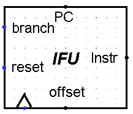
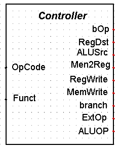
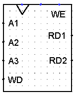
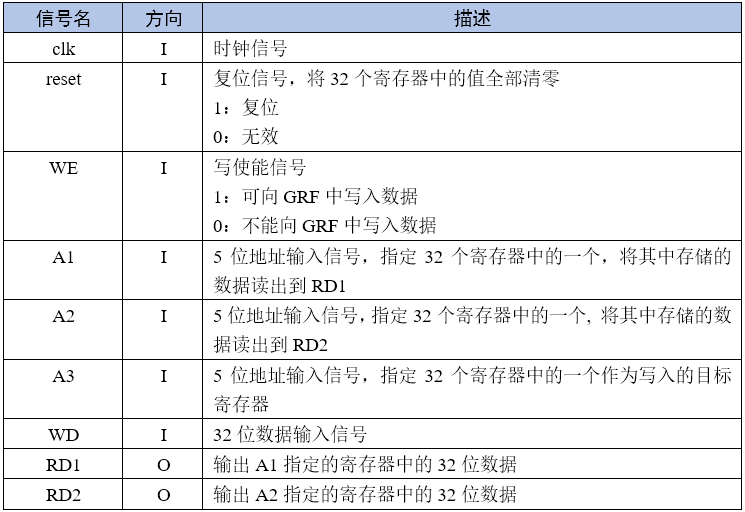
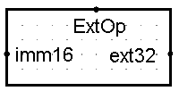
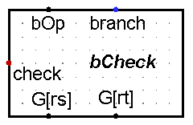

# P3_document

## 设计草稿

本次P3搭建的CPU支持`add, sub, ori, lw, sw, beq, lui, nop，begz，bgtz，blez，bltz，bne, j, jal`

### IFU (Instruction Fetch Unit)

PC和nPC内置在IFU中，通过branch信号控制PC变换逻辑



| 端口         | 方向 | 描述                       |
| ------------ | ---- | -------------------------- |
| Instr[31:0]  | O    | 输出32位指令二进制编码     |
| offset[31:0] | I    | 输入branch指令的地址偏移量 |
| reset        | I    | 复位信号                   |
| branch       | I    | 是否branch                 |
| PC           | O    | 用于测试PC                 |

### Controller

用于控制信息通路中的多路选择器，选择正确的功能



|              | add    | sub    | ori    | lw     | sw     | beq    | lui    | bgez   | bgtz   | blez   | bltz   | bne    | jump   | jal    |
| ------------ | ------ | ------ | ------ | ------ | ------ | ------ | ------ | ------ | ------ | ------ | ------ | ------ | ------ | ------ |
| **OpCode**   | 000000 | 000000 | 001101 | 100011 | 101011 | 000100 | 001111 | 000001 | 000111 | 000110 | 000001 | 000101 | 000010 | 000011 |
| **Function** | 100000 | 100010 | xxxxxx | xxxxxx | xxxxxx | xxxxxx | xxxxxx | 00001  | xxxxxx | xxxxxx | 00000  | xxxxxx | xxxxxx | xxxxxx |

|            | add  | sub  | ori      | lw         | sw         | branch     | lui        | jump | jal         |
| ---------- | ---- | ---- | -------- | ---------- | ---------- | ---------- | ---------- | ---- | ----------- |
| RegDst     | 01   | 01   | 00       | 00         | 00         | 00         | 00         | 00   | 11(const31) |
| ALUSrc     | 0    | 0    | 1        | 1          | 1          | 1          | 1          | 0    | 0           |
| Mem2Reg    | 00   | 00   | 00       | 01         | 00         | 00         | 00         | 00   | 10(PC + 4)  |
| RegWrite   | 1    | 1    | 1        | 1          | 0          | 0          | 1          | 0    | 1           |
| MemWrite   | 0    | 0    | 0        | 0          | 1          | 0          | 0          | 0    | 0           |
| nPC_Sel    | 0    | 0    | 0        | 0          | 0          | 1          | 0          | 0    | 0           |
| ExtOp      | 00   | 00   | 01(zero) | 10(signed) | 10(signed) | 10(signed) | 10(signed) | 00   | 0           |
| ALUOP<1,0> | 00   | 01   | 10       | 00(+)      | 00(+)      | 00(+)      | 11         | 00   | 0           |
| jump       | 0    | 0    | 0        | 0          | 0          | 0          | 0          | 1    | 1           |

|      | beq    | bgez   | bgtz   | blez   | bltz   | bne    |
| ---- | ------ | ------ | ------ | ------ | ------ | ------ |
| bOp  | 100000 | 010000 | 001000 | 000100 | 000010 | 000001 |

### GRF (General Register File)



> **引用自P0_Q2**
>
> GRF中包含32个32位寄存器，分别对应0~31号寄存器，其中0号寄存器读取的结果恒为0。
>
> 
>
> 

### ALU (Arithmetic Logic Unit)


| ALUOP | 描述             |
| ----- | ---------------- |
| 00    | 加法             |
| 01    | 减法             |
| 10    | 或               |
| 11    | 立即数加载到高位 |

### EXT (Extend)

用于数据扩展



| ExtOp | 操作       |
| ----- | ---------- |
| 00    | 无操作     |
| 01    | 0扩展      |
| 10    | signed扩展 |
| 11    | 1扩展      |

### bChecker (Branch Checker)

用于判断是否跳转



| 端口   | 方向 | 描述                                          |
| ------ | ---- | --------------------------------------------- |
| bOp    | I    | 连接到Controller.bOp，获取branch类型          |
| branch | I    | 连接到Controller.branch，判断是否是branch信号 |
| G[rs]  | I    | 连接到GRF.RD1                                 |
| G[rt]  | I    | 连接到GFR.RD2                                 |
| check  | O    | 判断是否符合branch条件，连接到IFU.branch      |

### jumpEXT

用于实现jump和jal指令，计算 ***PC31...28 || Instr_index || 00***


| 端口  | 方向 | 描述                              |
| ----- | ---- | --------------------------------- |
| index | I    | 获取Instr_index，即机器码的后26位 |
| PC    | I    | 获取PC的值                        |
| ext32 | O    | 下一个PC的值（nPC）               |


## 测试方案

随机生成数据  -> 导出十六进制文件 -> 自动化工具生成新电路 -> 比对mars运行结果和circ运行结果

**randomMipsCmd.py**

```python
import random
import time

def generate_register():
    """生成一个随机寄存器编号（0-31）。"""
    return random.randint(0, 31)

def generate_immediate():
    """生成一个随机立即数（0-65535）。"""
    return random.randint(0, 65535)

def generate_memory_address():
    """生成一个随机内存地址（0-3071，左移2位）。"""
    return random.randint(0, 3071) << 2

def write_instruction(file, instruction):
    """将指令写入文件。"""
    file.write(instruction + "\n")

def main():
    random.seed(time.time())
    length = int(input("请输入要生成的指令数量："))
    label_count = 0

    with open("result.asm", "w") as file:
        for _ in range(length):
            tmp = random.randint(0, 8)

            match tmp:
                case 0:
                    write_instruction(file, f"add ${generate_register()}, ${generate_register()}, ${generate_register()}")
                case 1:
                    write_instruction(file, f"sub ${generate_register()}, ${generate_register()}, ${generate_register()}")
                case 2:
                    write_instruction(file, f"ori ${generate_register()}, ${generate_register()}, {generate_immediate()}")
                case 3:
                    write_instruction(file, f"lw ${generate_register()}, {generate_memory_address()}($0)")
                case 4:
                    write_instruction(file, f"sw ${generate_register()}, {generate_memory_address()}($0)")
                case 5:
                    if label_count >= 1:
                        num1 = generate_register()
                        num2 = generate_register()
                        while num2 == num1:
                            num2 = generate_register()
                        write_instruction(file, f"ori ${num1}, ${num1}, {generate_immediate()}")
                        write_instruction(file, f"beq ${num1}, ${num2}, label{random.randint(0, label_count - 1)}")
                case 6:
                    write_instruction(file, f"lui ${generate_register()}, {generate_immediate()}")
                case 7:
                    write_instruction(file, "nop")
                case 8:
                    write_instruction(file, f"label{label_count}:")
                    label_count += 1

if __name__ == '__main__':
    main()

```


**autoWrite2Rom.py**

```python
import re

# 读取 ROM 文件内容
with open("python\\autoTest_P3\\rom.txt", "r", encoding="utf-8") as f:
    rom_content = f.read().strip()  # 去掉前后空白字符

# 读取电路文件
with open("python\\autoTest_P3\\cpu.circ", "r", encoding="utf-8") as cur_file:
    cur_content = cur_file.read()

# 使用正则表达式替换 ROM 内容
cur_content = re.sub(
    r'addr/data: 12 32([\s\S]*?)</a>',  # 使用非贪婪模式匹配
    f'addr/data: 12 32\n{rom_content}\n</a>',
    cur_content,
    flags=re.DOTALL  # 允许 . 匹配换行符
)

# 写入新的电路文件
with open("cpu_remake.circ", "w", encoding="utf-8") as file:
    file.write(cur_content)
```


## 思考题

1. **上面我们介绍了通过 FSM 理解单周期 CPU 的基本方法。请大家指出单周期 CPU 所用到的模块中，哪些发挥状态存储功能，哪些发挥状态转移功能。**
   > - 状态存储功能：IFU、GRF
   > - 状态转移功能：Controller、ALU、EXT、bCheckTT

2. **现在我们的模块中 IM 使用 ROM， DM 使用 RAM， GRF 使用 Register，这种做法合理吗？ 请给出分析，若有改进意见也请一并给出。**

   > 合理
   >
   > - ROM是只读存储器，不会被写入，内部数据不会被修改，适合用来储存指令。
   > - RAM可以存取存储器，可以被写入可以被读取，适合用来读取数据。
   > - GRF是寄存器堆，Register具有较高的读写速度，适合用来存储指令中的数据。

3. **在上述提示的模块之外，你是否在实际实现时设计了其他的模块？如果是的话，请给出介绍和设计的思路。**

   > 额外设计了Branch Checker，用于判断是否branch，设计思路见"设计草稿"

4. **事实上，实现 `nop` 空指令，我们并不需要将它加入控制信号真值表，为什么？**

   > nop的指令码是0x00000000，会被翻译为*** sll \$0, \$0 0***，即把$0的值左移0位存入\$0，因为\$0的值始终为零不会被改变，所以nop不会带来电路的任何改变。

5. **阅读 Pre 的 [“MIPS 指令集及汇编语言”](http://cscore.buaa.edu.cn/tutorial/mips/mips-6/mips6-1/) 一节中给出的测试样例，评价其强度（可从各个指令的覆盖情况，单一指令各种行为的覆盖情况等方面分析），并指出具体的不足之处。**

   > 强度一般
   >
   > 没有测试到所有的寄存器，也没有考虑到数据溢出的情况


