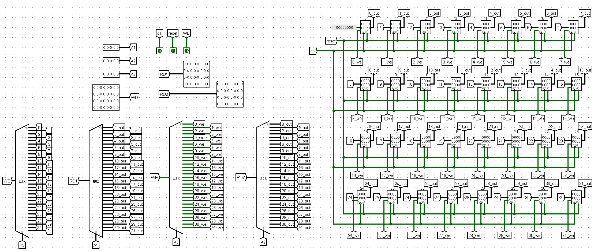

# P4_L0_document

## 信号解释

- **RegDst（寄存器写入地址）**
  - 2'b00: RT
  - 2'b01: RD
  - 2'b11: 5'h1f
  - default: 5'b0
- **Mem2Reg（寄存器写入数据）**
  - 2'b00: alu_c
  - 2'b01: dm_data
  - 2'b10: pc + 32'd4
  - default: 32'b0
- **ALUSrc（alu的b操作数选择）**
  - 1'b0: grf_RD2
  - 1'b1: ext_ext32
  - default: 32'b0
- **ALU_F（ALU计算方式）**
  - 4'b0000: add
  - 4'b0001: sub
  - 4'b0010: or
  - 4'b0011: SL16 (lui)
  - 4'b0100: SLL (补0逻辑左移)
  - 4’b0101: SRL (补0逻辑右移)
  - 4‘b0110: SRA (算数右移)
- **ExtOp (扩展操作)**
  - 2’b01: 0扩展
  - 2‘b10: 算术扩展（符号位）
  - 2’b11: 1扩展

## 设计草稿

本次CPU支持`add, sub, or, ori, lw, sw, lb, lbu, lh, sb, sh, beq, lui, nop，begz，bgtz，blez，bltz，bne, j, jal, jr`共23条指令。


### mips.v (Top)


#### Ports

| Port name | Direction | Type | Description |
| --------- | --------- | ---- | ----------- |
| clk       | input     |      |             |
| reset     | input     |      |             |

#### Signals

| Name          | Type        | Description |
| ------------- | ----------- | ----------- |
| pc            | wire [31:0] |             |
| if_jump       | wire        |             |
| if_branch     | wire        |             |
| instr_out     | wire [31:0] |             |
| ifu_offset    | wire [31:0] |             |
| OPCODE        | wire [5:0]  |             |
| FUNCT         | wire [5:0]  |             |
| RS            | wire [4:0]  |             |
| RT            | wire [4:0]  |             |
| RD            | wire [4:0]  |             |
| SHAMT         | wire [4:0]  |             |
| IMM           | wire [15:0] |             |
| INDEX         | wire [25:0] |             |
| bOp_out       | wire [5:0]  |             |
| RegDst_out    | wire [1:0]  |             |
| ALUSrc_out    | wire        |             |
| Mem2Reg_out   | wire [1:0]  |             |
| RegWrite_out  | wire        |             |
| MemWrite_out  | wire        |             |
| branch_out    | wire        |             |
| ExtOp_out     | wire [1:0]  |             |
| ALUOP_out     | wire [1:0]  |             |
| jumpSrc_out   | wire [1:0]  |             |
| dm_data       | wire [31:0] |             |
| ext_ext32     | wire [31:0] |             |
| grf_RD1       | wire [31:0] |             |
| grf_RD2       | wire [31:0] |             |
| alu_B         | wire [31:0] |             |
| alu_C         | wire [31:0] |             |
| grf_WA        | wire [4:0]  |             |
| grf_WD        | wire [31:0] |             |
| jumpext_ext32 | wire [31:0] |             |

#### Instantiations

- ifu: IFU

- controller: Controller

- grf: GRF

- alu: ALU

- dm: DM

- ext: EXT

- jumpext: jumpEXT

- bcheck: bCheck

  

### IFU.v


#### Ports

| Port name | Direction | Type   | Description |
| --------- | --------- | ------ | ----------- |
| clk       | input     |        |             |
| reset     | input     |        |             |
| jump      | input     |        |             |
| branch    | input     |        |             |
| offset    | input     | [31:0] |             |
| PC        | output    | [31:0] |             |
| Instr     | output    | [31:0] |             |


### Controller.v


#### Ports

| Port name | Direction | Type  | Description |
| --------- | --------- | ----- | ----------- |
| OpCode    | input     | [5:0] |             |
| Funct     | input     | [5:0] |             |
| rt        | input     | [4:0] |             |
| jump      | output    |       |             |
| jumpSrc   | output    | [1:0] |             |
| bOp       | output    | [5:0] |             |
| RegDst    | output    | [1:0] |             |
| ALUSrc    | output    |       |             |
| Mem2Reg   | output    | [1:0] |             |
| RegWrite  | output    |       |             |
| MemWrite  | output    |       |             |
| branch    | output    |       |             |
| ExtOp     | output    | [1:0] |             |
| ALUOP     | output    | [1:0] |             |

#### 信号映射表

|         | OpCode | Funct  | RT    |
| ------- | ------ | ------ | ----- |
| add     | 000000 | 100000 |       |
| sub     | 000000 | 100010 |       |
| or      | 000000 | 100101 |       |
| **SLL** | 000000 | 000000 |       |
| **SRL** | 000000 | 000010 |       |
| **SRA** | 000000 | 000011 |       |
| ori     | 001101 |        |       |
| lw      | 100011 |        |       |
| sw      | 101011 |        |       |
| **lb**  | 100000 |        |       |
| **lbu** | 100100 |        |       |
| **lh**  | 100001 |        |       |
| **sb**  | 101000 |        |       |
| **sh**  | 101001 |        |       |
| beq     | 000100 |        |       |
| lui     | 001111 |        |       |
| bgez    | 000001 |        | 00001 |
| bgtz    | 000111 |        |       |
| blez    | 000110 |        |       |
| bltz    | 000001 |        |       |
| bne     | 000101 |        | 00000 |
| jump    | 000010 |        |       |
| jal     | 000011 |        |       |
| jr      | 000000 | 001000 |       |

|            | add  | sub  | ori      | SLL  | SRL  | SRA  | or   | lw          | sw         | lb   | lbu  | lh   | sb   | sh   | branch     | lui        | jump | jal         | jr   |
| ---------- | ---- | ---- | -------- | ---- | ---- | ---- | ---- | ----------- | ---------- | ---- | ---- | ---- | ---- | ---- | ---------- | ---------- | ---- | ----------- | ---- |
| RegDst     | 01   | 01   | 00       | 01   | 01   | 01   | 01   | 00          | 00         | 00   | 00   | 00   | 00   | 00   | 00         | 00         | 00   | 11(const31) | 00   |
| ALUSrc     | 0    | 0    | 1        | 0    | 0    | 0    | 0    | 1           | 1          | 1    | 1    | 1    | 1    | 1    | 1          | 1          | 0    | 0           | 0    |
| Mem2Reg    | 00   | 00   | 00       | 00   | 00   | 00   | 00   | 01          | 00         | 01   | 01   | 01   | 00   | 00   | 00         | 00         | 00   | 10(PC + 4)  | 00   |
| RegWrite   | 1    | 1    | 1        | 1    | 1    | 1    | 1    | 1           | 0          | 1    | 1    | 1    | 0    | 0    | 0          | 1          | 0    | 1           | 0    |
| MemWrite   | 0    | 0    | 0        | 0    | 0    | 0    | 0    | 0           | 1          | 0    | 0    | 0    | 1    | 1    | 0          | 0          | 0    | 0           | 0    |
| branch     | 0    | 0    | 0        | 0    | 0    | 0    | 0    | 0           | 0          | 0    | 0    | 0    | 0    | 0    | 1          | 0          | 0    | 0           | 0    |
| ExtOp      | 00   | 00   | 01(zero) | 0    | 0    | 0    | 00   | ]10(signed) | 10(signed) | 10   | 10   | 10   | 10   | 10   | 10(signed) | 10(signed) | 00   | 0           | 0    |
| ALUOP<3,0> | 0000 | 0001 | 0010     | 0100 | 0101 | 0110 | 0010 | 0000(+)     | 0000(+)    | 0000 | 0000 | 0000 | 0000 | 0000 | 0000(+)    | 0011       | 0000 | 0000        | 0000 |
| jumpSrc    | 00   | 00   | 00       | 00   | 00   | 00   | 00   | 00          | 00         | 00   | 00   | 00   | 00   | 00   | 00         | 00         | 01   | 01          | 10   |
| jump       | 0    | 0    | 0        | 0    | 0    | 0    | 0    | 0           | 0          | 0    | 0    | 0    | 0    | 0    | 0          | 0          | 1    | 1           | 1    |
| ls_type    |      |      |          |      |      |      |      | 00          | 00         | 01   | 10   | 11   | 01   | 11   |            |            |      |             |      |


### GRF.v




#### Ports

| Port name | Direction | Type   | Description |
| --------- | --------- | ------ | ----------- |
| A1        | input     | [4:0]  |             |
| A2        | input     | [4:0]  |             |
| A3        | input     | [4:0]  |             |
| WD        | input     | [31:0] |             |
| clk       | input     |        |             |
| reset     | input     |        |             |
| WE        | input     |        |             |
| pc        | input     | [31:0] |             |
| RD1       | output    | [31:0] |             |
| RD2       | output    | [31:0] |             |


### DM.v


#### Ports

| Port name | Direction | Type   | Description |
| --------- | --------- | ------ | ----------- |
| A         | input     | [31:0] |             |
| D_input   | input     | [31:0] |             |
| str       | input     |        |             |
| clk       | input     |        |             |
| pc        | input     | [31:0] |             |
| D_output  | output    | [31:0] |             |


### ALU.v


#### Ports

| Port name | Direction | Type   | Description |
| --------- | --------- | ------ | ----------- |
| A         | input     | [31:0] |             |
| B         | input     | [31:0] |             |
| shamt     | input     | [4:0]  |             |
| F         | input     | [3:0]  |             |
| C         | output    | [31:0] |             |


### bCheck.v


#### Ports

| Port name | Direction | Type   | Description |
| --------- | --------- | ------ | ----------- |
| Grs       | input     | [31:0] |             |
| Grt       | input     | [31:0] |             |
| bOp       | input     | [5:0]  |             |
| branch    | input     |        |             |
| check     | output    |        |             |


### EXT.v


#### Ports

| Port name | Direction | Type   | Description |
| --------- | --------- | ------ | ----------- |
| imm16     | input     | [15:0] |             |
| ExtOp     | input     | [1:0]  |             |
| ext32     | output    | [31:0] |             |


### jumpEXT.v


#### Ports

| Port name | Direction | Type   | Description |
| --------- | --------- | ------ | ----------- |
| index     | input     | [25:0] |             |
| pc        | input     | [31:0] |             |
| ext32     | output    | [31:0] |             |


## 测试方案

- ***利用魔改Mars：*** 直接比较ISE得输出和Mars的输出

- ***课上环境：***在Isim中将32个Reg和内存添加到波形图中，对比最终结果

简单的测试代码：

```bash
#GRF REG_WRITE TEST
ori $1, 125
ori $2, 300
ori $3, $0, 5
ori $4, $0, 1024
ori $5, $0, 56
ori $6, $0,125
ori $7, $0, 525
ori $8, $0, 10086
ori $9, $0,14514
ori $10, $0, 625
ori $11, $0, 168
ori $12, $0, 576
ori $13, $0, 2048
ori $14, $0, 6666
ori $15, $0, 424
ori $16, $0, 2024
ori $16, $0, 1101
ori $17, $0, 2203
ori $18, $0, 2306
ori $19, $0, 999
ori $20, $0, 2005
ori $21, $0, 0
ori $22, $0, 176
ori $23, $0, 616
ori $24, $0, 1213
ori $25, $0, 1314
ori $26, $0, 888
ori $27, $0, 545
ori $28, $0, 28

#LUI TEST
lui $1, 424
lui $12, 500
lui $24, 233

#ADD or SUB TEST
add $21, $27, $28 
sub $21, $27, $28

#MEMORY TEST
sw $21, 0($0)
lw $28, 0($0)

#BRANCH TEST
beq $24, $25, beq_label_false
ori $24, $0, 1314
beq $24, $25, beq_label_true

beq_label_false:
ori $5, $0, 666

beq_label_true:
ori $5, $0, 667

#JUMP TEST
jal function
ori $5, $0, 0
ori $5, $0, 1
ori $5, $0, 9
j jump_label

function:
ori $5, $0, 1111
jr $ra

jump_label:
nop
nop
nop

bgez $0, bgez_label
ori $1, $0, 11451

bgez_label:
ori $1, $0, -10
bltz $1, bltz_label
ori $5, $0, 1314
ori $6, $0, 156

bltz_label:
bne $0, $1, bne_label
ori $5, $0, 131
ori $6, $0, 15

bne_label:
lui $12, 2333
```

```bash
//STDOUT
@00003000: $ 1 <= 0000007d
@00003004: $ 2 <= 0000012c
@00003008: $ 3 <= 00000005
@0000300c: $ 4 <= 00000400
@00003010: $ 5 <= 00000038
@00003014: $ 6 <= 0000007d
@00003018: $ 7 <= 0000020d
@0000301c: $ 8 <= 00002766
@00003020: $ 9 <= 000038b2
@00003024: $10 <= 00000271
@00003028: $11 <= 000000a8
@0000302c: $12 <= 00000240
@00003030: $13 <= 00000800
@00003034: $14 <= 00001a0a
@00003038: $15 <= 000001a8
@0000303c: $16 <= 000007e8
@00003040: $16 <= 0000044d
@00003044: $17 <= 0000089b
@00003048: $18 <= 00000902
@0000304c: $19 <= 000003e7
@00003050: $20 <= 000007d5
@00003054: $21 <= 00000000
@00003058: $22 <= 000000b0
@0000305c: $23 <= 00000268
@00003060: $24 <= 000004bd
@00003064: $25 <= 00000522
@00003068: $26 <= 00000378
@0000306c: $27 <= 00000221
@00003070: $28 <= 0000001c
@00003074: $ 1 <= 01a80000
@00003078: $12 <= 01f40000
@0000307c: $24 <= 00e90000
@00003080: $21 <= 0000023d
@00003084: $21 <= 00000205
@00003088: *00000000 <= 00000205
@0000308c: $28 <= 00000205
@00003094: $24 <= 00000522
@000030a0: $ 5 <= 0000029b
@000030a4: $31 <= 000030a8
@000030b8: $ 5 <= 00000457
@000030a8: $ 5 <= 00000000
@000030ac: $ 5 <= 00000001
@000030b0: $ 5 <= 00000009
@000030d4: $ 1 <= ffff0000
@000030d8: $ 1 <= fffffff6
@000030dc: $ 1 <= fffffff6
@000030f8: $12 <= 091d0000
```


### 思考题

1. 阅读下面给出的 DM 的输入示例中（示例 DM 容量为 4KB，即 32bit × 1024字），根据你的理解回答，这个 addr 信号又是从哪里来的？地址信号 addr 位数为什么是 [11:2] 而不是 [9:0] ？

   > addr信号来源于ALU的结果输出端。
   >
   > 输入信号为按字节索引的地址，而DM的存储方式为按字索引，取***addr[11:2]***即等于***addr[9:0] << 2***


2. 思考上述两种控制器设计的译码方式，给出代码示例，并尝试对比各方式的优劣。

   ```verilog
   	always @(*) begin
   		if (OpCode == 6'b000000) begin
   			if (Funct == 6'b100000) begin
   				//add
   				RegDst 	<= 2'b01;
   				ALUSrc 	<= 1'b0;
   				Mem2Reg 	<= 2'b00;
   				RegWrite <= 1'b1;
   				MemWrite <= 1'b0;
   				branch 	<= 1'b0;
   				ExtOp 	<= 2'b00;
   				ALUOP 	<= 2'b00;
   				jumpSrc 	<= 2'b00;
   				jump  	<= 1'b0;
   			end
   		end
   ```

   ```verilog
   always @(*) begin
       if (OpCode == 6'b100011 ||
           OpCode == 6'b101011 || 
           OpCode == 6'b000100 || 
           OpCode == 6'b001111) begin
       	ExtOp <= 2'b10; 
       end
       else if (OpCode == 6'b001101) begin
          ExtOp <= 2'b01; 
       end
       else begin
           ExtOp <= 2'b00;
       end
   end
   ```

   >- **记录指令对应的控制信号如何取值**：方便添加新指令。
   >- **记录控制信号每种取值所对应的指令**：方便添加控制信号。
   
   
   
3. 在相应的部件中，复位信号的设计都是**同步复位**，这与 P3 中的设计要求不同。请对比**同步复位**与**异步复位**这两种方式的 reset 信号与 clk 信号优先级的关系。

   > 异步复位reset信号优先，同步复位clk信号优先。


4. C 语言是一种弱类型程序设计语言。C 语言中不对计算结果溢出进行处理，这意味着 C 语言要求程序员必须很清楚计算结果是否会导致溢出。因此，如果仅仅支持 C 语言，MIPS 指令的所有计算指令均可以忽略溢出。 请说明为什么在忽略溢出的前提下，addi 与 addiu 是等价的，add 与 addu 是等价的。提示：阅读《MIPS32® Architecture For Programmers Volume II: The MIPS32® Instruction Set》中相关指令的 Operation 部分。

   > *The term “unsigned” in the instruction name is a misnomer; this operation is 32-bit modulo arithmetic that does not trap on overflow. This instruction is appropriate for unsigned arithmetic, such as address arithmetic, or integer arithmetic environments that ignore overflow, such as C language arithmetic.*
   >
   > addu和add的区别、addi和addiu的区别均仅在与是否有溢出判断，故忽略溢出时效果是一样的。
