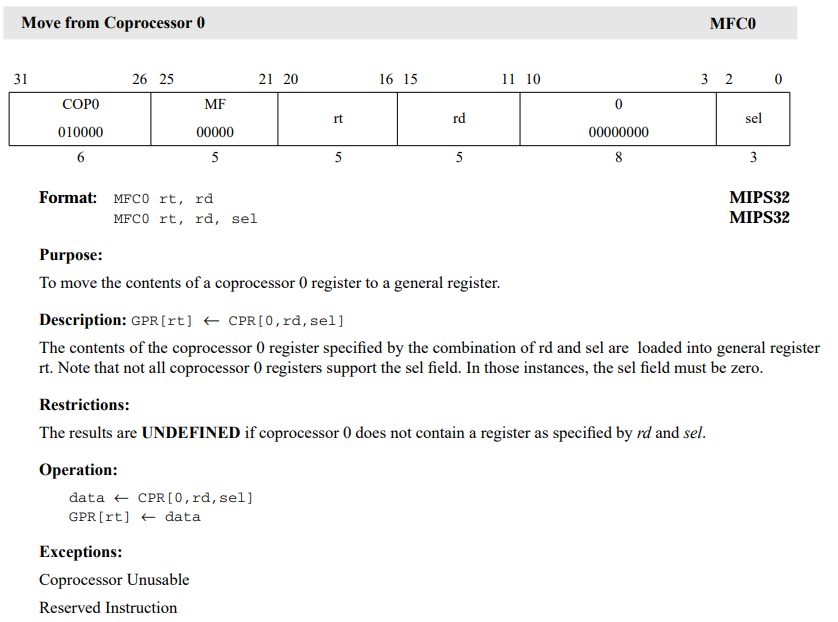
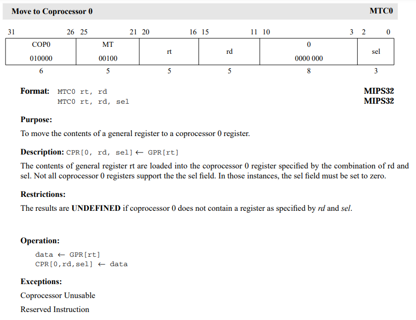
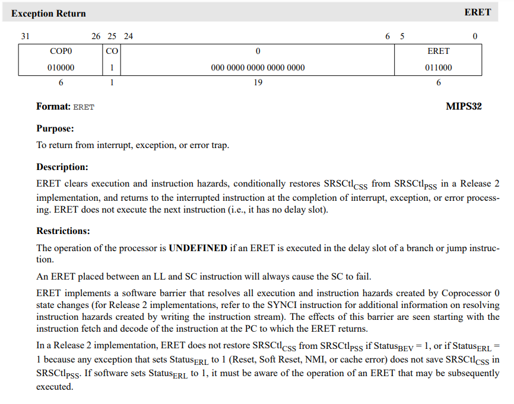
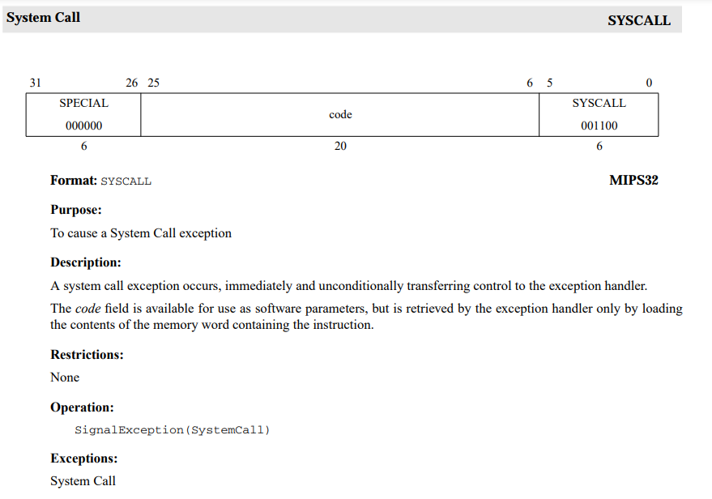
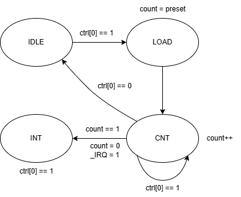
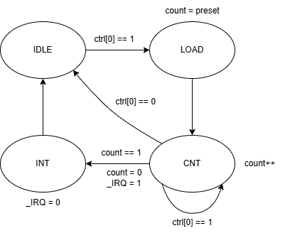

# P7_MIPS微系统

## 预备知识

### 异常程序处理

先要明白一点，Mars不会帮你处理中断异常，Mars遇到异常指令或中断信号会跳至中断异常处理程序（0x4180之后），如何处理中断异常完全由0x4180之后的代码决定。

先看课程组给出的示例程序

```bash
# 程序首先从这里运行
.text
    # 只允许外部中断
    ori $t0, $0, 0x1001
    mtc0 $t0, $12

    # 算术溢出
    lui $t0, 0x7fff
    lui $t1, 0x7fff
    add $t2, $t0, $t1

end:
    beq $0, $0, end
    nop

.ktext 0x4180
_entry:
    # 保存上下文
    j _save_context
    nop

_main_handler:
    # 取出 ExcCode
    mfc0 $k0, $13
    ori $k1, $0, 0x7c
    and $k0, $k0, $k1

    # 如果是中断，直接恢复上下文
    beq $k0, $0, _restore_context
    nop

    # 将 EPC + 4，即处理异常的方法就是跳过当前指令
    mfc0 $k0, $14
    addu $k0, $k0, 4
    mtc0 $k0, $14
    j _restore_context
    nop

_exception_return:
    eret

_save_context:
    ori $k0, $0, 0x1000     # 在栈上找一块空间保存现场
    addiu $k0, $k0, -256
    sw $sp, 116($k0)        # 最先保存栈指针
    move $sp, $k0

    # 依次保存通用寄存器（注意要跳过 $sp）、HI 和 LO
    sw $1, 4($sp)
    sw $2, 8($sp)
    # ......
    sw $31, 124($sp)
    mfhi $k0
    mflo $k1
    sw $k0, 128($sp)
    sw $k1, 132($sp)

    j _main_handler
    nop

_restore_context:
    # 依次恢复通用寄存器（注意要跳过 $sp）、 HI 和 LO
    lw $1, 4($sp)
    lw $2, 8($sp)
    # ......
    lw $31, 124($sp)
    lw $k0, 128($sp)
    lw $k1, 132($sp)
    mthi $k0
    mtlo $k1

    # 最后恢复栈指针
    lw $sp, 116($sp)

    j _exception_return
    nop
```

#### 代码解释

- **.text:**  Subsequent items (instructions) stored in Text segment at next available address.随后的条目（指令）存储在文本段的下一个可用地址中。普通的用户模式下的代码段，简单来说就是存指令的地方。
- **.ktext:**  Subsequent items stored in Kernel Text segment at next available address.随后的条目存储在内核文本段的下一个可用地址中。即内核模式下的代码段，内核模式下运行，具有最高权限，可以直接访问硬件和受保护的资源。对于p7来说就是存放异常处理程序的地方。

- 异常包括很多种类型，中断和异常也不同，不同的异常或中断处理方式不一样，因此我们需要记录下异常或中断的信息，然后用特定方式处理异常，这就是CP0（协处理器）的作用。
- 进入中断异常处理程序后，我们先从CP0中获取异常或中断信息，然后跳转至不同的地方处理异常中断，一般最后都会跳转到eret，返回主程序。

### CPU与外设的交互

CPU的作用就是对外界输入数据做出对应的处理后返回结果。

#### 外设

对于p7，我们有三个外设需要处理。这三个外设的作用就是时不时向cpu发出一个中断信号。

- 计时器（Timer）：计算机系统中的计时部件，可以按照配置定时地产生时钟中断。
- 存储器（Memory）：计算机系统中的存储部件，用于存储指令和数据。我们在 P6 的时候已经接触过了。
- 中断发生器（InterruptGenerator）：抽象的计算机系统外设，会随机的产生外部中断信号，产生的中断信号在 CPU 响应前会持续置高。

#### 内存

- 我们可以认为内存也是一种外设。

- 我们可以认为指令、数据、异常处理程序、外设寄存器等都是储存在同一内存中，只不过存储的位置不同，有着严格的界限。

| **条目**             | **地址或地址范围**                   | **备注**               |
| -------------------- | ------------------------------------ | ---------------------- |
| 数据存储器           | ***0x0000_0000***∼***0x0000_2FFF***  |                        |
| 指令存储器           | *** 0x0000_3000***∼***0x0000_6FFF*** |                        |
| PC 初始值            | ***0x0000_3000***                    |                        |
| 异常处理程序入口地址 | ***0x0000_4180***                    |                        |
| 计时器 0 寄存器地址  | ***0x0000_7F00***∼***0x0000_7F0B***  | 计时器 0 的 3 个寄存器 |
| 计时器 1 寄存器地址  | ***0x0000_7F10***∼***0x0000_7F1B***  | 计时器 1 的 3 个寄存器 |
| 中断发生器响应地址   | ***0x0000_7F20***∼***0x0000_7F23***  |                        |

### 宏观PC

对于流水线寄存器，每一流水级的PC都不同。我们希望CPU实现的功能应该是单周期的，引入多周期只是为了提高效率。如果我们把CPU封装起来，不关注内部的复杂过程，在外部看来CPU应该只有一个PC，即CPU一个周期仅执行一条指令。为此我们需要引入宏观PC的概念。

- 我们将 CP0 放在 M 级（大家都放在M级，方便对拍），因此也以 M 级为界线，规定 M 级的 PC 就是宏观 PC。
- **所谓“宏观”指令，表示该指令之前的所有指令序列对 CPU 的更新已完成，该指令及其之后的指令序列对 CPU 的更新未完成。**放在M级显然满足这个定义。


## Tasks

### Task-1: 建立与外界的联系

#### Timer

- Timer内部有三个寄存器: 0号寄存器ctrl、1号寄存器preset、2号寄存器count。虽然说是寄存器，但我们可以认为其实内存的一部分。

|      | 0号寄存器ctrl                       | 1号寄存器preset                     | 2号寄存器count                      |
| ---- | ----------------------------------- | ----------------------------------- | ----------------------------------- |
| TC1  | ***0x0000_7F00***∼***0x0000_7F03*** | ***0x0000_7F04***∼***0x0000_7F07*** | ***0x0000_7F08***∼***0x0000_7F0b*** |
| TC2  | ***0x0000_7F10***∼***0x0000_7F13*** | ***0x0000_7F14***∼***0x0000_7F17*** | ***0x0000_7F18***∼***0x0000_7F1b*** |

- 我们可以通过sw指令向对应Timer寄存器中存值以开启计时并调整倒计时。

  ```bash
      # MODE 0 for timer1
      ori $t1 $0 9 #设置计时使能和中断屏蔽
      sw $t1 0x7F00($0)
      ori $t1 $0 1 #设置计时数
      sw $t1 0x7F04($0)
      
      # MODE 1 for timer1
      ori $t1 $0 11 #设置计时使能和中断屏蔽
      sw $t1 0x7F00($0)
      ori $t1 $0 10 #设置计时数
      sw $t1 0x7F04($0)
  ```
  
  

### Task-2: 记录异常并流水

- where CP0: M级。
- 延迟槽指令: 如果一个处于延迟槽的指令发生了异常，我们从异常处理程序中返回时需要回到它的上一个指令（跳转指令）。因此我们需要增加判断一个信号用于判断指令是否在延迟槽中，并向后流水传至CP0。（branch、jump、jal、jr在ID级，IF级的指令即处于延迟槽中）。

```verilog
assign BD_IF = ((branch_ID === 1'b1) || (jump_ID === 1'b1))? 1'b1:
			   1'b0;
```

- 内部异常和外部中断：同时发生时处理外部中断，当内部无异常时设为Int(外部中断)。
- 一条指令多个异常 & 多个指令异常：**优先处理最早可以探查到的异常**。

| 异常与中断码 | 助记符与名称           | 指令与指令类型       | 描述                                                |      |
| :----------- | :--------------------- | :------------------- | :-------------------------------------------------- | ---- |
| 0            | `Int` （外部中断）     | 所有指令             | 中断请求，来源于计时器与外部中断。                  |      |
| 4            | `AdEL` （取指异常）    | 所有指令             | PC 地址未字对齐。                                   | 1    |
| 4            | `AdEL` （取指异常）    | 所有指令             | PC 地址超过 `0x3000 ~ 0x6ffc`。                     | 1    |
| 4            | `AdEL` （取数异常）    | `lw`                 | 取数地址未与 4 字节对齐。                           | 1    |
| 4            | `AdEL` （取数异常）    | `lh`                 | 取数地址未与 2 字节对齐。                           | 1    |
| 4            | `AdEL` （取数异常）    | `lh`, `lb`           | 取 Timer 寄存器的值。                               |      |
| 4            | `AdEL` （取数异常）    | load 型指令          | 计算地址时加法溢出。                                | 1    |
| 4            | `AdEL` （取数异常）    | load 型指令          | 取数地址超出 DM、Timer0、Timer1、中断发生器的范围。 |      |
| 5            | `AdES` （存数异常）    | `sw`                 | 存数地址未 4 字节对齐。                             | 1    |
| 5            | `AdES` （存数异常）    | `sh`                 | 存数地址未 2 字节对齐。                             | 1    |
| 5            | `AdES` （存数异常）    | `sh`, `sb`           | 存 Timer 寄存器的值。                               |      |
| 5            | `AdES` （存数异常）    | store 型指令         | 计算地址加法溢出。                                  | 1    |
| 5            | `AdES` （存数异常）    | store 型指令         | 向计时器的 Count 寄存器存值。                       |      |
| 5            | `AdES` （存数异常）    | store 型指令         | 存数地址超出 DM、Timer0、Timer1、中断发生器的范围。 |      |
| 8            | `Syscall` （系统调用） | `syscall`            | 系统调用。                                          |      |
| 10           | `RI`（未知指令）       | -                    | 未知的指令码。                                      |      |
| 12           | `Ov`（溢出异常）       | `add`, `addi`, `sub` | 算术溢出。                                          | 1    |

#### IF级

- PC 地址未字对齐 `AdEL`
- PC 地址超过 0x3000 ~ 0x6ffc  `AdEL`

```verilog
// in PC module
assign exc = ((pc < 32'h3000) || (pc > 32'h6ffc))? 4'd4:
			 (pc[1:0] != 2'b0)? 4'd4: 4'd0;
```

#### ID级

- 未知的指令码 `RI`
- syscall 对于syscall指令我们只需发出一个异常信号即可  `syscall` 

如果有if嵌套，注意内部if对应的else也需要判断为未知指令。

```verilog
// in controller module
if (OpCode == xxxxxx) begin
    if (Funct == xxxxxx) begin
       //ctrl signal assignment 
    end
    else begin
        //exception RI
		exc = 4'd10; 
    end
end
else if (OpCode == xxxxxx) begin
    //ctrl signal assignment 
end
else begin
    //exception RI
	exc = 4'd10; 
end
```

#### EX级

-  算术溢出 `OV`

```verilog
	 wire [32:0] A_ext = {A[31],A};
	 wire [32:0] B_ext = {B[31],B};
	 
	 wire [32:0] addi_temp = A_ext + B_ext;
	 wire addi_overflow = ((F == `ADDI) && (addi_temp[32] != addi_temp[31]));
	 
	 wire [32:0] add_temp = A_ext + B_ext;
	 wire add_overflow = ((F == `ADD) && (add_temp[32] != add_temp[31]));
	 
	 wire [32:0] sub_temp = A_ext - B_ext;
	 wire sub_overflow = ((F == `SUB) && (sub_temp[32] != sub_temp[31]));
	 
	 assign exc = (addi_overflow | add_overflow | sub_overflow)? 4'd12: 4'd0;
```

#### MA级

- load类指令
  - lw取数地址未与 4 字节对齐 `AdEL`
  - lh、lb取数地址未与 2 字节对齐  `AdEL`
  - lh、lb取 Timer 寄存器的值：寄存器的值为32位，取半字或比特是非法行为非法  `AdEL`
  - 计算地址时加法溢出 `AdEL`
  - 取数地址超出 DM、Timer0、Timer1、中断发生器的范围 `AdEL`
- store类指令
  - sw存数地址未 4 字节对齐 `AdES` 
  - sh、sb存数地址未 2 字节对齐 `AdES` 
  - sh、sb存 Timer 寄存器的值 ：寄存器的值为32位，存半字或比特是非法行为非法 `AdES` 
  - 计算地址加法溢出 `AdES` 
  - 向计时器的 Count 寄存器存值 ：计时器的count寄存器是只读寄存器(read-only) `AdES` 
  - 存数地址超出 DM、Timer0、Timer1、中断发生器的范围 `AdES` 

```verilog
	 //load EXC
	 wire exc_load_align = (((load_type_MA == 3'b111) && (byte_offset != 2'b00)) || //lw
								  ((load_type_MA == 3'b100) && (byte_offset[0] != 1'b0))); //lh
	 
	 wire exc_load_adov = (load_type_MA && (EX_EXCCode_pip_MA == 4'd12));
	 
	 wire exc_load_OutOfRange = !(((ALU_C_MA >= 32'h0) && (ALU_C_MA <= 32'h2fff)) || //DM
										  ((ALU_C_MA >= 32'h7f00) && (ALU_C_MA <= 32'h7f0b)) || //TC0
										  ((ALU_C_MA >= 32'h7f10) && (ALU_C_MA <= 32'h7f1b))); //TC1
	 
	 wire exc_load_timer = ((load_type_MA == 3'b100 || load_type_MA == 3'b010) && ALU_C_MA >= 32'h7f00); 
										  
    wire EXCCode_ADEL = (load_type_MA) && (exc_load_align || exc_load_adov || exc_load_OutOfRange || exc_load_timer);
	 
	 //store EXC
	 wire exc_store_align = (((store_type_MA == 3'b001) && (byte_offset != 2'b00)) ||
							((store_type_MA == 3'b100) && (byte_offset[0] != 1'b0)));
											
	 wire exc_store_adov = (store_type_MA && (EX_EXCCode_pip_MA == 4'd12)); //addr overflow
	 
	 wire exc_store_OutOfRange = !(((ALU_C_MA >= 32'h0) && (ALU_C_MA <= 32'h2fff)) || //DM
								  ((ALU_C_MA >= 32'h7f00) && (ALU_C_MA <= 32'h7f0b)) || //TC0
								  ((ALU_C_MA >= 32'h7f10) && (ALU_C_MA <= 32'h7f1b))); //TC1

	 wire exc_store_timer = (store_type_MA && ALU_C_MA >= 32'h0000_7f08 && ALU_C_MA <= 32'h0000_7f0b) ||
							(store_type_MA && ALU_C_MA >= 32'h0000_7f18 && ALU_C_MA <= 32'h0000_7f1b) ||
							((store_type_MA == 3'b010 || store_type_MA == 3'b100) && ALU_C_MA >= 32'h7f00); 
									
	 wire EXCCode_ADES = (store_type_MA) && (exc_store_align || exc_store_adov || exc_store_OutOfRange || exc_store_timer);
	 
	 assign MA_EXCCode_pip_MA = EXCCode_ADEL? 4'd4: 
								EXCCode_ADES? 4'd5:
								4'd0;
```


### Task-3: 加入协处理器CP0

- 所有寄存器均为32bits
- 处理中断和异常信号，判断是否发出req信号，发出req信号时所有流水寄存器清空（部分信号需要特殊处理）
- eret指令需要清空EXL部分
- 0001_0000

| 寄存器               | 寄存器编号 | 功能域                  | 位域  | 解释                                                         |
| :------------------- | ---------- | :---------------------- | :---- | :----------------------------------------------------------- |
| SR（State Register） | 12         | IM（Interrupt Mask）    | 15:10 | 分别对应六个外部中断，相应位置 1 表示允许中断，置 0 表示禁止中断。这是一个被动的功能，只能通过 `mtc0` 这个指令修改，通过修改这个功能域，我们可以屏蔽一些中断。 |
| SR（State Register） | 12         | EXL（Exception Level）  | 1     | 任何异常发生时置位，这会强制进入核心态（也就是进入异常处理程序）并禁止中断。 |
| SR（State Register） | 12         | IE（Interrupt Enable）  | 0     | 全局中断使能，该位置 1 表示允许中断，置 0 表示禁止中断。     |
| Cause                | 13         | BD（Branch Delay）      | 31    | 当该位置 1 的时候，EPC 指向当前指令的前一条指令（一定为跳转），否则指向当前指令。 |
| Cause                | 13         | IP（Interrupt Pending） | 15:10 | 为 6 位待决的中断位，分别对应 6 个外部中断，相应位置 1 表示有中断，置 0 表示无中断，将会每个周期被修改一次，修改的内容来自计时器和外部中断。 |
| Cause                | 13         | ExcCode                 | 6:2   | 异常编码，记录当前发生的是什么异常。                         |
| EPC                  | 14         | -                       | -     | 记录异常处理结束后需要返回的 PC。                            |

| 端口      | 方向 | 位数 | 解释                                     |
| :-------- | :--- | :--- | :--------------------------------------- |
| clk       | IN   | 1    | 时钟信号。                               |
| reset     | IN   | 1    | 复位信号。                               |
| en        | IN   | 1    | 写使能信号。                             |
| CP0Add    | IN   | 5    | 读取/写入目标寄存器地址。                |
| CP0In     | IN   | 32   | 写入寄存器数据。                         |
| CP0Out    | OUT  | 32   | 读出寄存器数据。                         |
| VPC       | IN   | 32   | 当前异常中断发生时PC的值。               |
| BDIn      | IN   | 1    | 当前异常中断发生指令是否是延迟槽内指令。 |
| ExcCodeIn | IN   | 5    | 当前发生异常类型。                       |
| HWInt     | IN   | 6    | 外部产生的中断信号。                     |
| EXLClr    | IN   | 1    | 是否结束异常中断处理（复位 EXL）。       |
| EPCOut    | OUT  | 32   | EPC 的值。                               |
| Req       | OUT  | 1    | 进入处理程序请求。                       |

```verilog
`define IM regs[12][15:10]
`define EXL regs[12][1]
`define IE regs[12][0]
`define BD regs[13][31]
`define IP regs[13][15:10]
`define EXCCode regs[13][6:2]	 
	 // SR-12, Cause-13, EPC-14
	 reg [31:0] regs [0:31];
	 assign CP0Out = regs[CP0Addr];
	 
	 wire IntReq = (|(HWInt & `IM)) & !`EXL & `IE; // 允许当前中断 且 不在中断异常中 且 允许中断发生
	 wire ExcReq = (|EXCCodeIn) & !`EXL; // 存在异常 且 不在中断中
	 assign Req = IntReq | ExcReq;
	 
	 wire [31:0] tempEPC = (Req) ? (BDIn ? VPC-4 : VPC)
                            : regs[14];

	 assign EPCOut = {tempEPC[31:2], 2'b0};
	 
	 integer i;
	 
	 initial begin
		for (i=0;i<32;i=i+1) begin
			regs[i] = 0;
		end
	 end
	 
	 always @(posedge clk) begin
		if (reset) begin
			for (i=0;i<32;i=i+1) begin
				regs[i] <= 0;
			end
		end
		else begin
			`IP <= HWInt;
			if (en) begin
				regs[CP0Addr] <= CP0In;
			end
			if (Req) begin // int|exc
				`EXCCode <= IntReq ? 5'b0 : EXCCodeIn;
				`EXL <= 1'b1;
				regs[14] <= tempEPC;
				`BD <= BDIn;
			end
			if (EXLClr) begin
				`EXL <= 1'b0;
			end
		end
	 end
```


### Task-4: 加指令

在 P6 基础上新增了 `mfc0, mtc0, eret, syscall` 四条新指令

目前p7要求实现如下指令：(最好把jump指令也实现了，方便处理异常)

```
nop, add, sub, and, or, slt, sltu, lui
addi, andi, ori
lb, lh, lw, sb, sh, sw
mult, multu, div, divu, mfhi, mflo, mthi, mtlo
beq, bne, jal, jr,
mfc0, mtc0, eret, syscall
```

#### MFC0

把CP0中的rd号寄存器的值存入grf的rt寄存器

- 需要简单处理下转发，类似lw的转发



#### MTC0

将grf的rt号寄存器的值存入CP0的rd号寄存器



#### ERET

从错误处理程序中返回到主程序

- 在ID级时设置next_pc为CP0的EXC
- 在ID级时清空延迟槽，确保后续指令不会被处理
- 到达MA级时，需要清空CP0的EXL部分，表示当前不在处于核心状态（异常处理程序）
- 在ID级时，如果EX或MA级是MTC0且目标寄存器为14号（EXC）则阻塞，确保返回地址正确。



#### syscall

在controller里发出一个异常信号（异常码为8）即可




### 流水寄存器行为

#### 为什么要修改寄存器的清空行为？

我们在阻塞的时候会在EX级产生一个bubble，可以看作nop不发生任何作用，但实际上我们要把CPU封装为单周期CPU，级两条相邻的指令之间不会莫名其妙多出来一个nop指令。

试想，如果不修改清空逻辑的情况下，ID级是一个延迟槽内的指令，正常来说它到达MA级时如果发生了异常或中断，我们的EPC是需要写入PC-4的，因为我们从异常处理程序中返回时需要返回到延迟槽指令的前一条指令（即跳转指令）。而如果延迟槽内的指令在ID级时发生了阻塞产生了一个'nop'，nop流水到MA级时发生了异常或中断我们该如何记录EPC？这个'nop'在外部看来是不应该存在的，其没有对应的PC，其对应的PC应该是延迟槽指令的PC，其也应该被标记为延迟槽内指令，这样从异常处理程序中返回时才能返回到正确的地址。

按照从上至下的优先级依次处理

| 信号                                                         | PC流水寄存器行为            | BD流水寄存器行为 | 其他流水寄存器行为 |
| ------------------------------------------------------------ | --------------------------- | ---------------- | ------------------ |
| `reset`                                                      | 复位至 `0x00003000`         | 复位至 `0`       | 清空               |
| `req`                                                        | 设置为 `0x00004180`         | 设置为 `0`       | 清空               |
| `ID_EXLClr` （仅对F级到D级流水寄存器起作用，**且此时stall信号为0**） | 设置为当前周期的 `EPC` 的值 | 不发生变化       | 清空               |
| `flush`（仅指对D级到E级流水寄存器起作用的阻塞信号）          | 不发生变化                  | 不发生变化       | 清空               |

#### PC

```verilog
    always @(posedge clk) begin
        if (reset || req) begin
            pc <= req? 32'h4180: 32'h3000;
        end
        else begin
            if (en) begin
               pc <= next_pc;
            end
        end
    end
```

#### IF_ID Reg

clear_bd表示清空延迟槽，对于P7仅针对eret指令

```verilog
	 always @(posedge clk) begin
		if (reset || clr || req || clear_bd) begin
            //置0操作省略
			pc_add4_out <= (reset)? 32'h00003004:
						   (req)? 32'h00004184:
						   (clear_bd)? EPC:
							0;
			BD_out <= (clear_bd)? BD: 0;
		end else begin
			if (en) begin
                //省略
			end
		end
	 end
```

#### ID_EX Reg

```verilog
	 always @(posedge clk) begin
		if (reset || stall || req) begin
            //置0操作省略
			pc_add4_out <= (reset)? 32'h00003004:
								(req)? 32'h00004184: 
								(stall)? pc_add4:
								0;
			BD_out <= (stall)? BD: 0;
		end
		else begin
			if (en) begin
				//省略
			end
		end
	 end
```

#### EX_MA Reg

```verilog
	 always @(posedge clk) begin
			if (reset || clr || req) begin
                //置0操作省略
				pc_add4_out <= reset? 32'h00003004:
							   req? 32'h00004184: 
							   0;
			end else begin
				if (en) begin
                    //省略
				end
			end
	 end
```

#### MA_WB Reg

```verilog
	always @(posedge clk) begin
		if (clr || reset || req) begin
            //置0操作省略
			pc_add4_out <= reset? 32'h00003004:
								req? 32'h00004184:
								0;
		end else begin
			if (en) begin
                //省略
			end
		end
```

## 我的Bug

以下是我在通过课下弱测和中测后发现的bug：

- 不涉及计算操作时ALUOP默认设为了`ADD，导致不是ALU类指令时出现了溢出情况。
- 当MA级异常时，如果EX级为mthi或mtlo时仍会向HI或LO中写入值。
- 当PC错误或遇到未知指令时没有向后传递nop。
- mtc0位于MA级时，如果当出现中断时，仍会向CP0中的寄存器写入值。
- EXCCode优先级问题。load或store指令会触发EX级的算术overflow（异常码12）异常，在MA级也会除法overflow（异常码4或5）的异常，按照`优先处理先探查到的错误`的原则我们会选择EX级的算术overflow，导致存入CP0的异常码错误。


## 测试方案

- 手动构造样例确保新指令的功能正确性，尽可能覆盖大部分异常情况。
- 随机生成指令强测确保转发和阻塞的正确性。对CO-Killer略加修改，生成符合要求的随机数据。
- 限制读写寄存器的范围，能够尽可能多的造成数据冒险，再加上大量随机数据，基本可以覆盖全部转发和阻塞情况。
- 利用自己写的python脚本填充nop至0x4180。
- 定时器产生周期性中断信号，测试timer的中断是否正确被处理。
- 修改testbench产生中断，测试中断发生器发出的中断是否正确被处理。

```python
# 填充nop
last_pc = input('enter the last pc in text: ')
pc = int(last_pc, 16) + 4
while pc < 0x4180:
    print(f"# {hex(pc)}\nnop")
    pc += 4
```


## 思考题

1. 请查阅相关资料，说明鼠标和键盘的输入信号是如何被 CPU 知晓的？

> 鼠标和键盘产生中断信号，进入中断处理区的对应位置，将输入信号从鼠标和键盘中读入寄存器。

2. 请思考为什么我们的 CPU 处理中断异常必须是已经指定好的地址？如果你的 CPU 支持用户自定义入口地址，即处理中断异常的程序由用户提供，其还能提供我们所希望的功能吗？如果可以，请说明这样可能会出现什么问题？否则举例说明。（假设用户提供的中断处理程序合法）

> - 指定好的中断处理入口地址由硬件设计决定，能确保所有中断和异常按照既定逻辑处理。如果允许用户自定义入口地址，用户可能会直接跳过关键的上下文保存步骤，导致程序状态紊乱
> - 指定的中断地址通常位于受保护的系统区域，由操作系统或固件控制。用户故意定义有害的中断处理程序，例如窃取敏感信息或修改关键数据。

3. 为何与外设通信需要 Bridge？

> * CPU与外设数据吞吐量存在差异：Bridge充当缓冲区和速率匹配器，协调高速的处理器与低速外设之间的数据交换。
> * 地址映射差异：Bridge可以对地址进行解码，将处理器的访问请求转化为外设能够理解的操作。

4. 请阅读官方提供的定时器源代码，阐述两种中断模式的异同，并针对每一种模式绘制状态移图。

>**MODE 0**
>
>定时产生中断信号
>
>
>
>**MODE 1**
>
>周期性产生中断信号
>
>

5. 倘若中断信号流入的时候，在检测宏观 PC 的一级如果是一条空泡（你的 CPU 该级所有信息均为空）指令，此时会发生什么问题？在此例基础上请思考：在 P7 中，清空流水线产生的空泡指令应该保留原指令的哪些信息？

> 如果此时有一个中断或异常信号，则CP0记录下的PC为0x0000，在从异常处理程序返回时会发生错误。
>
> 应该保留PC值，由于在Req信号有效时，通过将流水寄存器的PC值不进行复位，使得达到精确异常的效果。使得回到EPC时依然是精确的。

6. 为什么 `jalr` 指令为什么不能写成 `jalr $31, $31`？

> 如果 `jalr $31 $31 `的延迟槽内发生异常或需要响应中断。那么 `$31` 寄存器的值已经被 `jalr` 改变，但是处理异常结束后，会再次执行 `jalr` 指令，这就会跳转到不正确的 `PC` 地址。

7. [P7 选做] 请详细描述你的测试方案及测试数据构造策略。

> 见上文


## 课程组官方TestBench

```verilog
`timescale 1ns/1ps

module mips_txt;

	reg clk;
	reg reset;
	reg interrupt;

	wire [31:0] macroscopic_pc;

	wire [31:0] i_inst_addr;
	wire [31:0] i_inst_rdata;

	wire [31:0] m_data_addr;
	wire [31:0] m_data_rdata;
	wire [31:0] m_data_wdata;
	wire [3 :0] m_data_byteen;

	wire [31:0] m_int_addr;
	wire [3 :0] m_int_byteen;

	wire [31:0] m_inst_addr;

	wire		w_grf_we;
	wire [4 :0] w_grf_addr;
	wire [31:0] w_grf_wdata;

	wire [31:0] w_inst_addr;

	mips uut(
		.clk(clk),
		.reset(reset),
		.interrupt(interrupt),
		.macroscopic_pc(macroscopic_pc),

		.i_inst_addr(i_inst_addr),
		.i_inst_rdata(i_inst_rdata),

		.m_data_addr(m_data_addr),
		.m_data_rdata(m_data_rdata),
		.m_data_wdata(m_data_wdata),
		.m_data_byteen(m_data_byteen),

		.m_int_addr(m_int_addr),
		.m_int_byteen(m_int_byteen),

		.m_inst_addr(m_inst_addr),

		.w_grf_we(w_grf_we),
		.w_grf_addr(w_grf_addr),
		.w_grf_wdata(w_grf_wdata),

		.w_inst_addr(w_inst_addr)
	);

	initial begin
		clk <= 0;
		reset <= 1;
		interrupt <= 0;
		#20 reset <= 0;
	end

	integer i;
	reg [31:0] fixed_addr;
	reg [31:0] fixed_wdata;
	reg [31:0] data[0:4095];
	reg [31:0] inst[0:5119];

	// ----------- For Instructions -----------

	assign m_data_rdata = data[(m_data_addr >> 2) % 5120];
	assign i_inst_rdata = inst[((i_inst_addr - 32'h3000) >> 2) % 5120];

	initial begin
		$readmemh("code.txt", inst);
		for (i = 0; i < 5120; i = i + 1) data[i] <= 0;
	end

	// ----------- For Data Memory -----------

	always @(*) begin
		fixed_wdata = data[(m_data_addr >> 2) & 4095];
		fixed_addr = m_data_addr & 32'hfffffffc;
		if (m_data_byteen[3]) fixed_wdata[31:24] = m_data_wdata[31:24];
		if (m_data_byteen[2]) fixed_wdata[23:16] = m_data_wdata[23:16];
		if (m_data_byteen[1]) fixed_wdata[15: 8] = m_data_wdata[15: 8];
		if (m_data_byteen[0]) fixed_wdata[7 : 0] = m_data_wdata[7 : 0];
	end

	always @(posedge clk) begin
		if (reset) for (i = 0; i < 4096; i = i + 1) data[i] <= 0;
		else if (|m_data_byteen && fixed_addr >> 2 < 4096) begin
			data[fixed_addr >> 2] <= fixed_wdata;
			$display("%d@%h: *%h <= %h", $time, m_inst_addr, fixed_addr, fixed_wdata);
		end
	end

	// ----------- For Registers -----------

	always @(posedge clk) begin
		if (~reset) begin
			if (w_grf_we && (w_grf_addr != 0)) begin
				$display("%d@%h: $%d <= %h", $time, w_inst_addr, w_grf_addr, w_grf_wdata);
			end
		end
	end

	// ----------- For Interrupt -----------

	wire [31:0] fixed_macroscopic_pc;

	assign fixed_macroscopic_pc = macroscopic_pc & 32'hfffffffc;

	parameter target_pc = 32'h00003010;

	integer count;

	initial begin
		count = 0;
	end

	always @(negedge clk) begin
		if (reset) begin
			interrupt = 0;
		end
		else begin
			if (interrupt) begin
				if (|m_int_byteen && (m_int_addr & 32'hfffffffc) == 32'h7f20) begin
					interrupt = 0;
				end
			end
			else if (fixed_macroscopic_pc == target_pc) begin
				if (count == 0) begin
					count = 1;
					interrupt = 1;
				end
			end
		end
	end

	always #2 clk <= ~clk;

endmodule
```