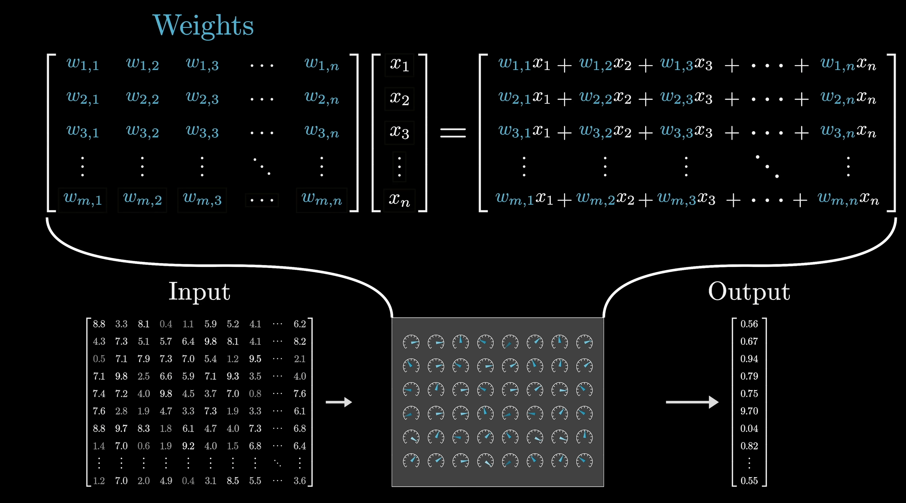
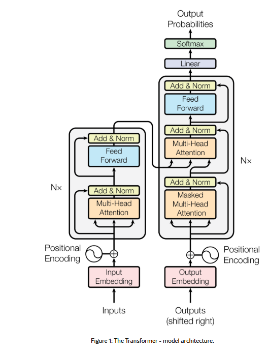
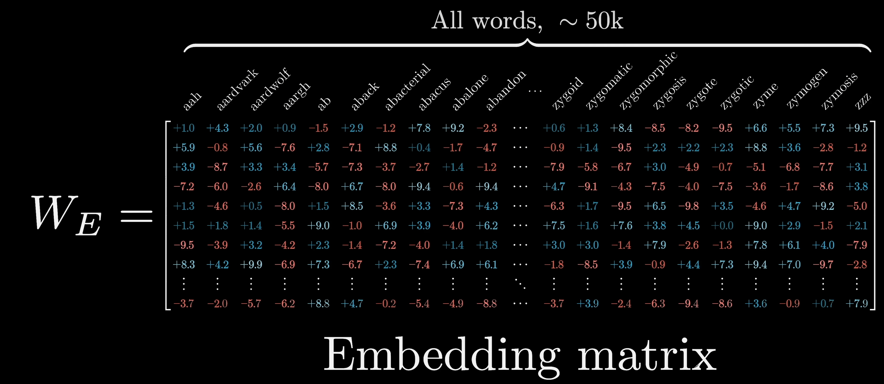
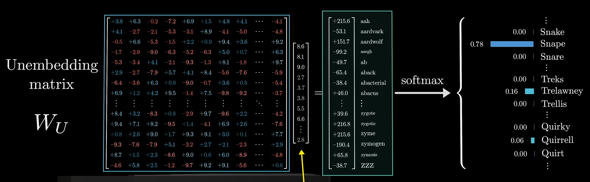
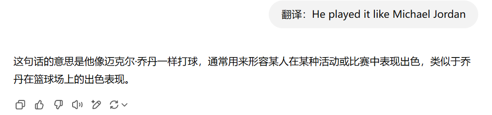
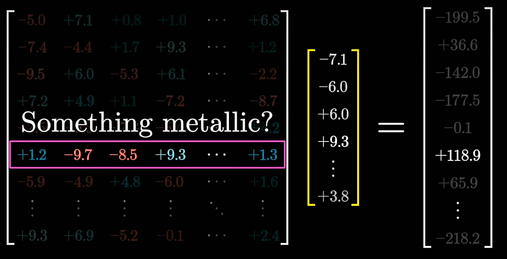
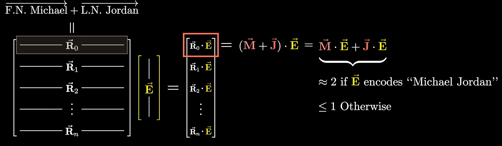
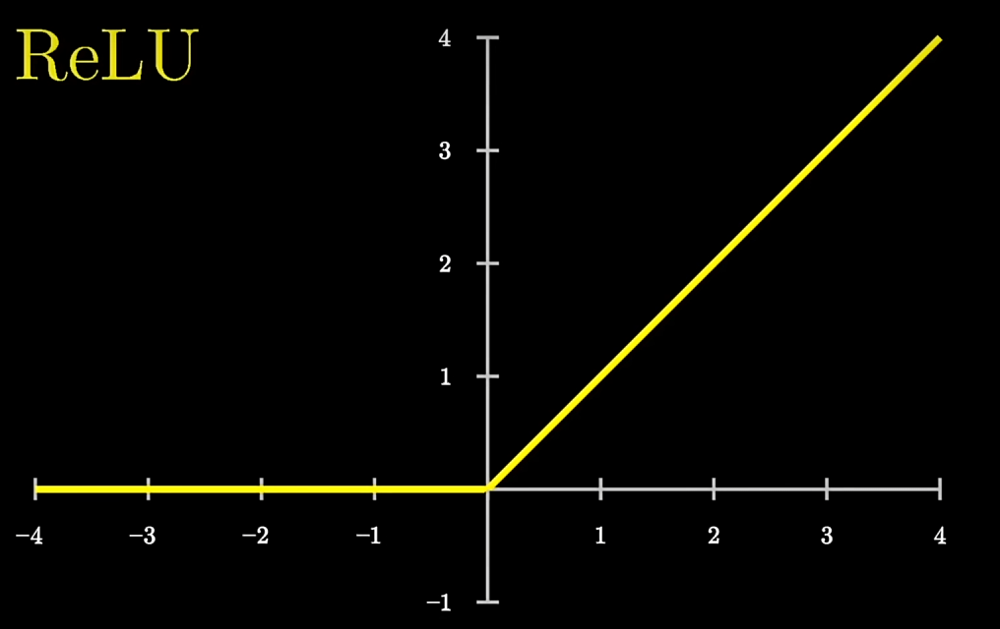
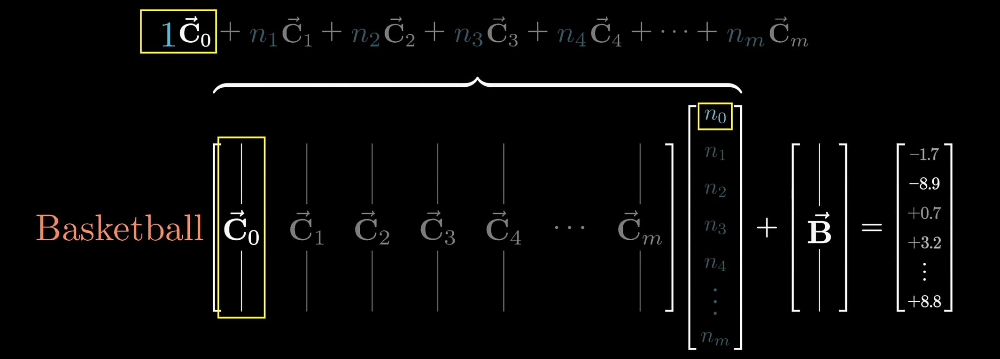

# Transformer

Transformer 最早在2017年的[《Attention Is All You Need》](https://link.zhihu.com/?target=https%3A//arxiv.org/abs/1706.03762)论文中提出，通过引入 **自注意力（Self-Attention）+ 位置编码（Positional Encoding）+ 多头注意力（Multi-Head Attention）+ 前馈网络（Feed-Forward Network）**，解决了传统 Seq2Seq 模型在处理**可变长序列**时的长距离依赖、计算效率等关键问题。

> **seq2seq**，序列到序列，输入为一段序列，输出也是一段序列，如翻译任务。
>
> **处理可变长序列**，指的是在自然语言处理（NLP）等任务中，模型需要能够应对**不同长度**的输入或输出序列，而不是固定长度的数据。

with transformer you can

- voice-to-text
- text-to-voice
- text-to-image...

《Attention is All You Need》专注于把一种语言翻译成另一种，这也是Transformer最初的设计目的，而后来被广泛应用于各种自然语言处理（NLP）任务，比如ChatGPT、DeepSeek等大模型，本文主要介绍最基础的transformer结构。

## A High-Level Look

$$
Transfomer(我是一个学生) = I\space am\space a\space studuent
$$

## Token Embedding 词嵌入

> ***Can you can a can like a canner can a can.***

- token? 单词片段或标点符号
- 将每个token转化为对应的高维向量，构成Embedding matrix
  - Embedding matrix随机初始化，并通过数据进行学习
  - GPT-3中每个token的向量有12288个维度
  - 向量的方向代表语义，语义相似的token有着相似的方向
  - 两个词的差异也会体现在向量之差，例如man和woman的向量之差与uncle和aunt的向量之差相似，也可以理解为$\vec{uncle}+(\vec{woman}-\vec{man}) = \vec{aunt}$
- 得到的词向量无上下文语义，但是其性质决定其可以用于分析上下文
  - Attention的目标就是让单个token通过上下文获得更丰富的语义。（比如判断出每个can的含义）
  - 上下文长度指的即是模型每次能处理的向量数目（预测下一个token时结合的文本量）
- Unembedding matrix 解嵌入矩阵，可以将一个向量解析为对应的单词

## Positional encoding

引入额外的位置编码刻画数据在时序上的特征
$$
PE_{pos,2i}=sin(pos/10000^{2i/d_{model}})\\
PE_{pos,2i+1}=cos(pos/10000^{2i/d_{model}})
$$

## Encoder 

- self-attention自注意力机制
- Feed Forward Neural Network 前馈神经网络

### Self-Attention 自注意力机制

> ***“ Can you can a can like a canner can a can. ”***

- can 代指的是什么？需要联系上下文

##### Q、K、V

**如何理解矩阵形式的Q、K、V：**在map/dict查询时我们可以根据key查询数据，如果query=key，那么取出key对应的数据。但是对于矩阵形式的Q、K、V，这样并不可行，只能变得soft一些，计算query和key的关系之后再对value加权求和。（softmax也是类似的思想）

-  $Query\space vector = \vec{E} \times W_Q$
- $ Key\space vector=\vec{E}\times W_K$
- $Value\space vector = \vec{E}\times W_V$
  - Value反映了如果要改变目标词的语义，需要对目标词的embedding加上一个什么样的向量

- $W_K\space W_K\space W_V$均通过训练获得

$$
Softmax(\frac{q_i\cdot k_j}{\sqrt{d_k}})\\ d_k\space is\space the \space dimension\space of\space the\space key\space vector
$$

这个公式表示在j位置的token在i位置的表达量，显然i位置本身的token在i位置表达量最大。

- query点乘key得到一个较大的正数，即称key代表的embedding注意到了query代表的embedding
- 如果是一个较小值或负值，则代表两个词互不相关

$$
z_i = \sum_{j=1}^{n} softmax(\frac{q_i\cdot k_j}{\sqrt{d_k}}) \times v_j \\or\\
Attention(Q,K,V) = softmax(\frac{QK^T}{\sqrt{d_k}})V
$$
之后我们用softmax score乘每个位置上的value向量再求和，即可得到该位置上的self-attention层的输出向量$z_1$，$z_1$之后会传入feed-forward neural network。

#### Multi-head attention 多头注意力机制

模型在对当前位置的信息进行编码时，会过度的将注意力集中于自身的位置

> Multi-head attention allows the model to jointly attend to information from different representation subspaces at different positions.

- 提高模型对其他位置的注意力。之前的方法得到的z向量尽管以及包含了其他位置的编码信息，但是其仍主要受自身的影响。

- Transformer有8个注意力头，即每个encoder/decoder有八组QKV
- 每组QKV分别按上述方法进行计算得到一组z向量，再将他们拼接起来叉乘一个新的矩阵$W^o$，得到一个新的z向量

### Inside the Multilayer Perception 多层感知器

推理需要事实作为依据，大模型是如何存储事实的？

#### Linear (up projection)

- 乘一个矩阵$W_{\uparrow}$，将向量映射到高维空间
- 矩阵的每一行都是一个问题 (简化理解)

- $\vec{B_{\uparrow}}$为Bias偏置，确保当embedding与问题相符时为1，其他情况为0或负

$$
W_{\uparrow}\vec{E}+\vec{B_{\uparrow}}
$$

#### ReLU线性整流函数

- 对得到的高维向量进行处理：非线性函数，将负值映射为0，正值不变 

#### Linear (down projection)

- 对高维向量进行降维处理，使输出向量的维数降回到嵌入空间的维数

$$
W_{\downarrow}(\space ReLU(W_{\uparrow}\vec{E}+B_{\uparrow})\space) + B_{\downarrow}
$$

### Residuals 残差

- 在每个子层（如自注意力层和前馈神经网络层）中，残差连接允许输入信号绕过子层，直接与子层的输出相加。这意味着输出是子层的原始输入与子层的变换输出的和。
- 用于帮助解决深度神经网络训练过程中的梯度消失或梯度爆炸问题。

  - 梯度消失：梯度趋近于零，网络权重无法更新或更新的很微小，网络训练再久也不会有效果；
  - 梯度爆炸：梯度呈指数级增长，变的非常大，然后导致网络权重的大幅更新，使网络变得不稳定。

  $$
  output=x+F(x)\space(其中 F(x)F(x)F(x) 表示子层的复杂变换)
  $$

  即使 F(x)F(x)F(x) 部分可能会导致数值不稳定，恒等项 xxx 总能为梯度提供一个稳定的基础，从而改善整体训练的稳定性。

## Decoder

- 解码器也含有这两个层，但是中间增加了一个注意力层帮助解码器关注到相关的输入
- 解码器的self-attention与编码器稍有不同，其只关注输出序列中位于当前位置之前的token（masking掩码）
  - 掩码：在计算 $q_i\cdot k_j$ 时将将 $j>i$ 的项置为$-\infin$，在softmax的过程中$-\infin$会被转化为0，起到屏蔽作用

## Linear Layer

实际上，decoder的输出是一个浮点型的向量，如何得到一个token？

- 线性层是一个全链接神经网络，将decoder的输出向量转化为一个更大的向量（logits vector）
- logits vector的维度等于“output vocabulary”所包含的token数（模型在训练中学习到的的token），logits vector中的每一格就是对某个token的评分
- 之后softmax layer会将logits vector转化为概率（归一化，所有数值相加等于一），选取概率最大的token

## softmax with temperature

softmax对向量进行归一化，确保$\sum x_n = 1$
$$
\begin{bmatrix}
x_1\\
x_2\\
x_3\\
...
\end{bmatrix}
\rightarrow
\begin{bmatrix}
\frac{e^{x_1/T}}{\sum_{n=0}^{N-1}e^{x_n/T}}\\
\frac{e^{x_2/T}}{\sum_{n=0}^{N-1}e^{x_n/T}}\\
\frac{e^{x_3/T}}{\sum_{n=0}^{N-1}e^{x_n/T}}\\
...
\end{bmatrix}
$$

- T越大，会给小数值赋予更多的权重，分布越均匀
  - 模型更愿意选择可能性较低的词
- T越小，较大的数组优势会更明显。
  - T = 0时模型总是会选择最可能的词

## 参考资料

- 《Attention Is All You Need》 https://arxiv.org/abs/1706.03762 
- https://jalammar.github.io/illustrated-transformer/
- https://www.3blue1brown.com/topics/neural-networks