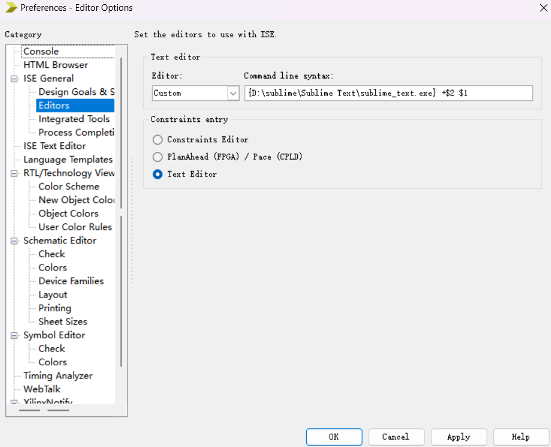
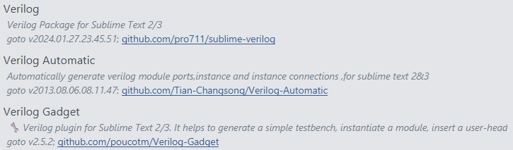
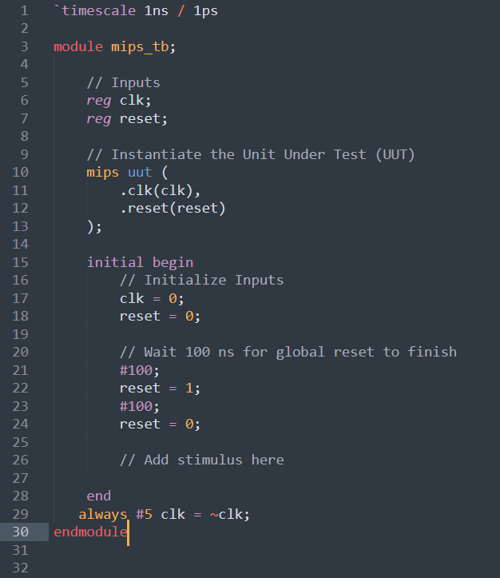
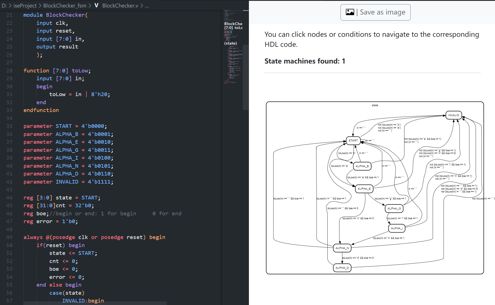
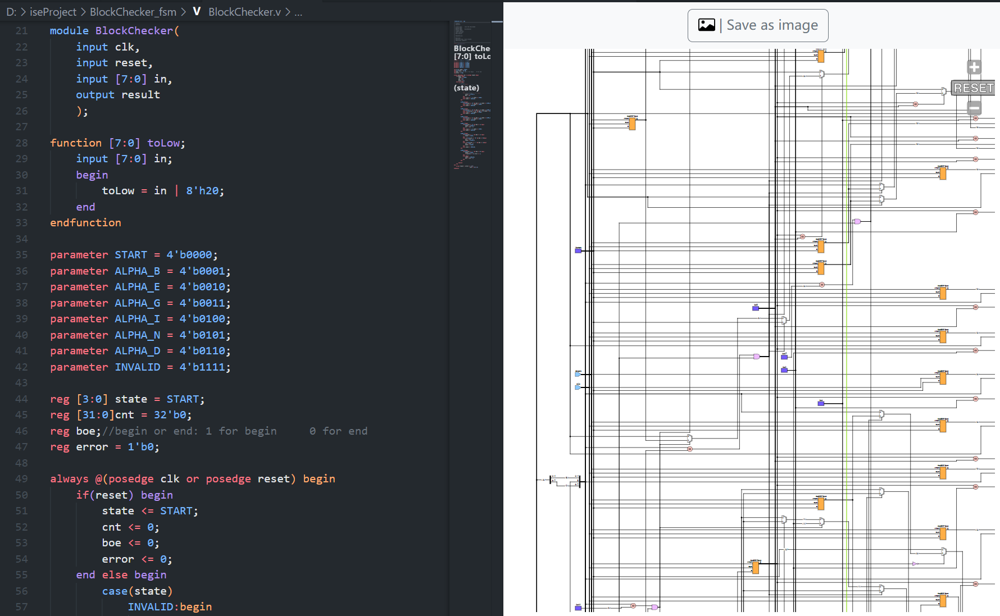
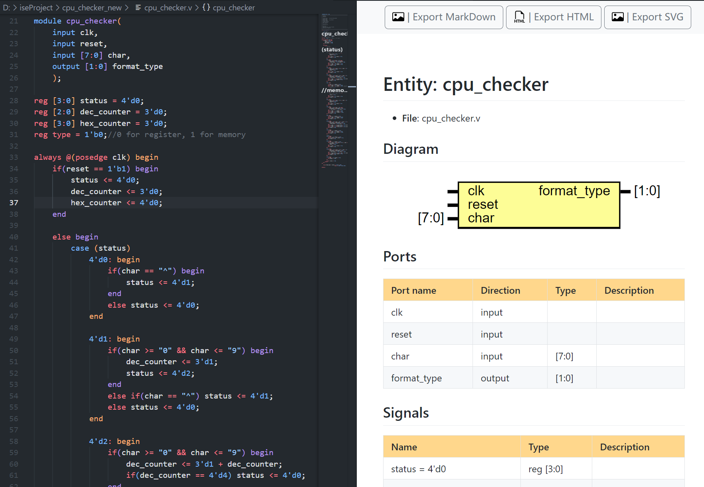
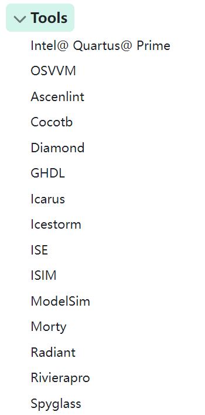

# 如何优雅地编写Verilog

## 一、替换ISE默认编辑器

ISE仿佛知道自己的默认编辑器很难用，所以允许用户自定义编辑器（

打开ISE，上方工具栏**Edit -> Preferences**，在左侧Category选择**ISE General -> Editors**，第一栏下拉选项选择**Custom**，在后面一栏输入编辑器的路径，我们以sublime为例，格式如下（大括号内为自己的路径）

> {D:\sublime\Sublime Text\sublime_text.exe} +\$2 \$1



设置完成后我们在ISE中点击自己verilog文件就可以自动跳转至指定编辑器了

sublime默认并不支持verilog文件，所以我们还需要安装相关插件



这些插件可以实现基本的语法补全、代码高亮等功能，效果如下



在编辑器编辑完保存后，我们可以返回ISE进行后续的仿真、查看波形图等功能。

## 二、强大的VScode插件——TerosHDL


具体配置过程见官网：[TerosHDL](https://terostechnology.github.io/terosHDLdoc/docs/intro/)

除了基础的语法补全功能，该插件提供如下功能：

- 显示项目中各个模块或文件之间的层次结构和依赖关系

- 实时错误检查

- 自动模板用于testbench等

- 自动生成文档

- 生成状态机的状态转移图

- 代码格式化

- 生成原理图

- 以及许多编辑工具：语法高亮、悬停提示、名称重构、名称重构、代码折叠、求值字面量

  

  

  

此外，这款插件还可以集成外部工具，如使用iverilog编译、GTKWave查看波形，而且好像还支持ISE的命令行工具？期待大家进一步探索。



## 三、VScode + ISE命令行工具

TerosHDL的配置比较麻烦，如果想简单一点，可以使用VScode + ISE命令行工具

详情请见大佬的帖子,[通过命令行，更优雅地利用ISE进行开发](http://cscore.buaa.edu.cn/#/discussion_area/1461/1777/posts)

在VScode中编写verilog文件后，直接在VScode中新建一个.bat文件，复制以下内容，然后在文件资源管理器中双击打开即可实现一键**编译、仿真、查看波形**，基本可以脱离ISE。

```bat
@echo off

REM 编译
"%XILINX%\bin\nt64\fuse.exe" -nodebug -prj mips.prj -o mips.exe mips_tb
IF ERRORLEVEL 1 (
    echo 编译失败，请检查错误。
    pause
)

REM 运行仿真
mips.exe -nolog -tclbatch mips.tcl
IF ERRORLEVEL 1 (
    echo 仿真失败，请检查错误。
    pause
)

REM 查看波形
"%XILINX%\bin\nt64\isimgui.exe" -view isim.wdb
IF ERRORLEVEL 1 (
    echo 查看波形失败，请检查错误。
    pause
)

pause  REM 暂停，以便查看输出
```

